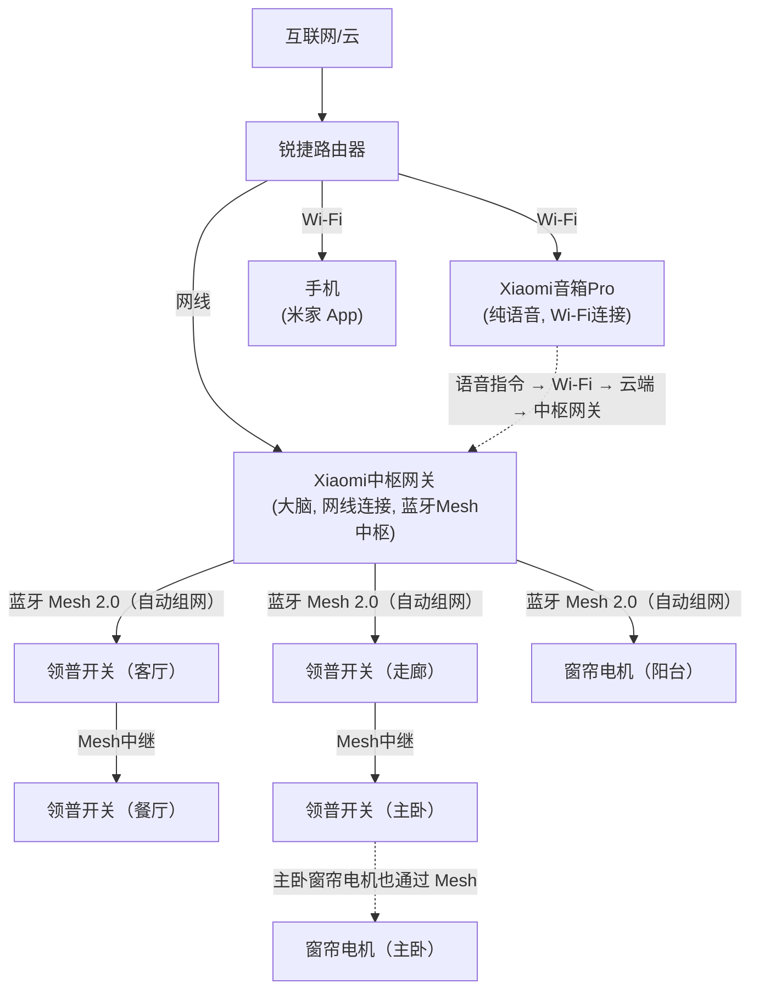
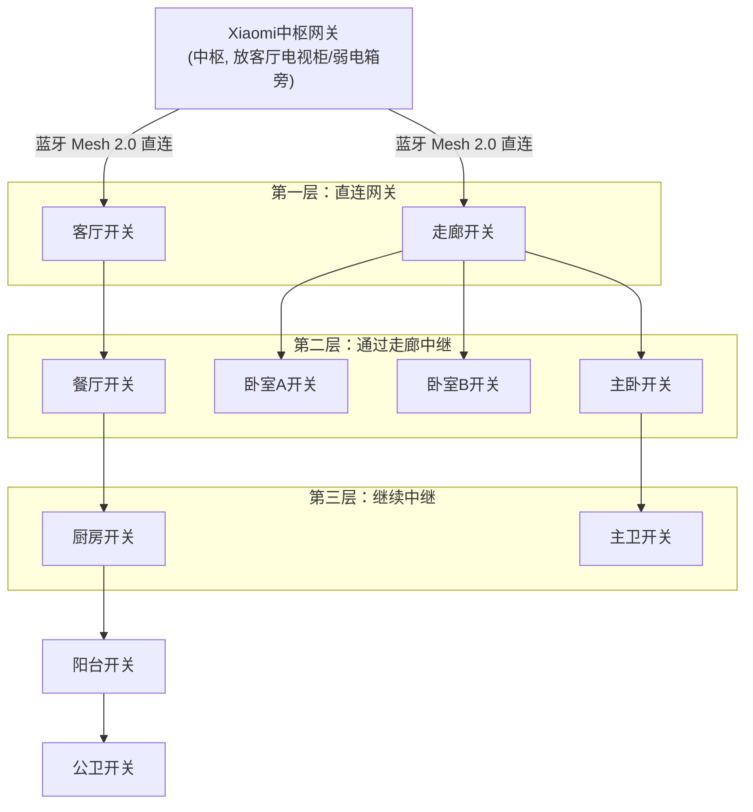
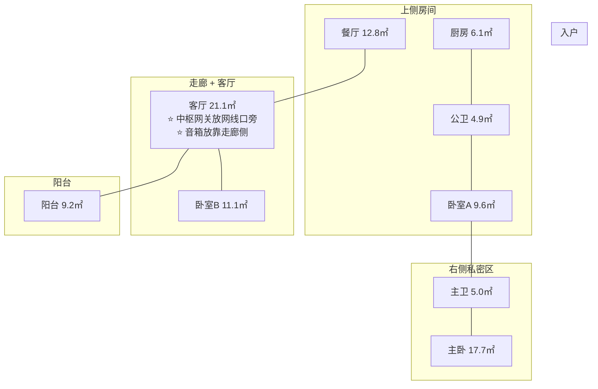
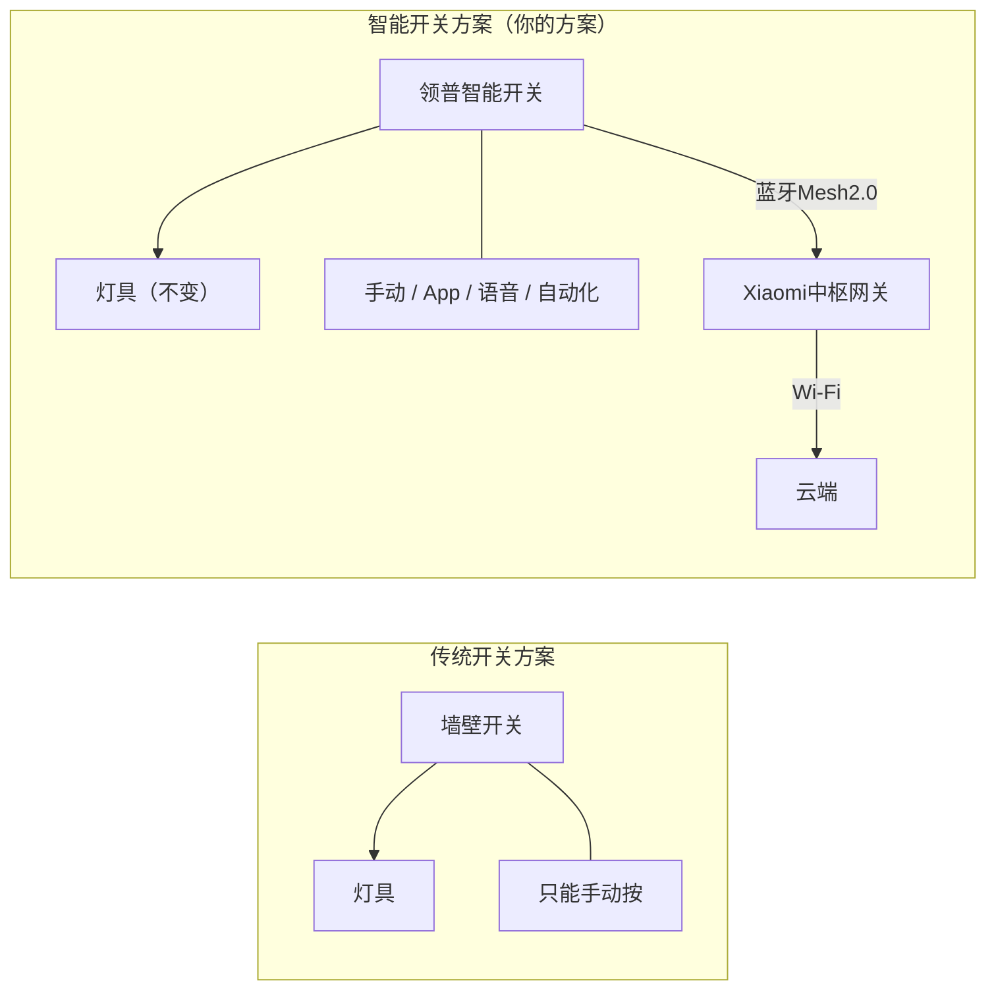

# 01 - 系统架构

## 整体方案

用智能开关替换传统开关，不改灯具、不改线路，成本最低的智能化方案。

## 系统拓扑图



> 中枢网关是全屋智能的大脑和蓝牙 Mesh 中枢，音箱只负责语音唤起。
> 中枢网关通过网线直连路由器，蓝牙 Mesh 2.0 连接所有设备，断网也能执行本地自动化。

## 通信链路说明

| 层级 | 协议 | 说明 |
|------|------|------|
| 云端 ↔ 路由 | Wi-Fi | 远程控制、OTA 升级 |
| 路由 ↔ 中枢网关 | 网线(RJ45) | 中枢网关有线直连路由器，稳定可靠 |
| 路由 ↔ 音箱 | Wi-Fi | 音箱通过 Wi-Fi 接收语音指令 |
| 中枢网关 ↔ 设备 | 蓝牙Mesh2.0 | 低功耗、自组网、设备互相中继 |
| 手机 ↔ 设备 | 蓝牙 | 局域网直连控制（网关离线也能用） |

## 蓝牙 Mesh 2.0 组网原理



**关键点：**
- 每个领普开关都是蓝牙 Mesh 2.0 中继节点
- 设备越多，网络覆盖越好（和 Wi-Fi 相反）
- 你家 9 个开关 + 2 个窗帘电机 = 11 个 Mesh 节点，覆盖绰绰有余
- 即使网关离线，设备之间的 Mesh 通信不受影响

## Wi-Fi 不稳定会影响开关吗？

::: warning 很多人担心 Wi-Fi 信号差导致开关不灵，这是最常见的误解
:::

**Wi-Fi vs 蓝牙 Mesh 2.0 的职责划分：**

| 操作方式 | 用到的网络 | Wi-Fi 挂了还能用？ |
|---------|-----------|-------------------|
| 物理按键 | 不需要任何网络 | ✅ 永远可用 |
| 手机蓝牙直连 | 蓝牙（不用WiFi） | ✅ 完全不影响 |
| App 局域网控 | Wi-Fi 局域网 | ⚠️ 需要手机和音箱同一局域网 |
| App 远程控制 | Wi-Fi + 互联网 | ❌ Wi-Fi 断了不行 |
| 语音控制 | Wi-Fi + 互联网 | ❌ 音箱断网无法识别语音 |
| 自动化场景 | 中枢网关（本地） | ✅ 中枢网关本地执行，断网也能用 |

::: tip 结论
物理按键 和 蓝牙直连 = 永远可用，跟 Wi-Fi 没任何关系

Wi-Fi 只影响：远程控制、语音控制、自动化场景
- 这些是「锦上添花」，不是基础功能
- 即使 Wi-Fi 全挂了，开关照样能按、灯照样能亮灭
:::

### 你家的网线口分布（实际布线条件）

::: info 网线口分布
- ✅ 客厅靠外墙 ─── 1 个网线口（电视旁边）
- ✅ 书房/卧室B ─── 1 个网线口
- ❌ 其他房间 ───── 没有网线口
:::

::: tip 对智能家居的影响：几乎没有影响！
- 领普开关 → 蓝牙 Mesh 2.0，不需要网线 ✅
- 窗帘电机 → 蓝牙 Mesh 2.0，不需要网线 ✅
- 人体/温湿度传感器 → 蓝牙 Mesh 2.0，不需要网线 ✅
- 小爱音箱 → Wi-Fi 连接，不需要网线 ✅

网线口只影响路由器放哪 → 路由器只要保障音箱有 Wi-Fi

全屋智能 90% 走蓝牙 Mesh 2.0，网线口少根本不是问题
:::

### 如何保障 Wi-Fi 稳定（让语音/远程不掉线）

::: info 结合你家布线条件的最佳实践
1. **主路由放客厅网线口旁（靠外墙侧）**
   - 利用现有网线口，直连光猫
   - 覆盖客厅、餐厅、厨房、阳台
   - Xiaomi音箱Pro 在客厅靠走廊侧，Wi-Fi 几米内信号没问题

2. **子路由放书房/卧室B（有线回程）**
   - 利用书房网线口做有线回程，比无线回程稳定得多
   - 覆盖书房、卧室A、主卧、主卫
   - 主卧小爱 mini 隔一堵墙，Wi-Fi 信号足够强
   - 推荐：小米 Mesh 路由（~300元两只装）

3. **2.4G 频段比 5G 穿墙好**
   - 小爱音箱用 2.4G 连接更稳定
   - 手机日常可以用 5G（快），但 IoT 设备走 2.4G

4. **不要开路由器的「设备隔离」或「AP 隔离」**
   - 开了之后手机和音箱不能互通，App 控制会失败
:::

**你家两个网线口刚好覆盖两个音箱位置：**

| 客厅（主路由 + 中枢网关） | 书房（子路由，有线回程） |
|:---:|:---:|
| 客厅 ← 中枢网关 + 音箱 Pro | 书房 |
| 餐厅 | 卧室A |
| 厨房 | 主卧 ← mini |
| 阳台 | 主卫 |

> 走廊、公卫 → 两个路由交叉覆盖，无死角

::: warning 重点
Wi-Fi 稳定性只影响「远程+语音+场景」。开关本身的蓝牙 Mesh 2.0 通信和 Wi-Fi 完全无关，所以不用担心「Wi-Fi 不好导致开关不灵」。
:::

## 中枢网关和音箱放哪里？（针对你家户型）

你家实际户型（参照 home.jpg）：



::: info 空间关系分析
- **左侧公共区**：餐厅 + 客厅 + 阳台 + 厨房
- **右侧私密区**：卧室A + 卧室B + 主卧 + 主卫
- **中间过渡区**：走廊 + 公卫

客厅是全屋最大的空间（21.1㎡），且正好在中间偏左。走廊连接客厅和三个卧室。
:::

::: tip ⭐ 中枢网关放客厅电视柜/弱电箱旁（靠网线口）

**中枢网关位置（核心）：**
- 中枢网关必须用网线连路由器 → 放在客厅网线口附近（电视柜/弱电箱旁）
- 中枢网关是蓝牙 Mesh 2.0 中枢，负责连接所有设备
- 走廊开关作为 Mesh 中继，卧室信号完全不用担心

**音箱位置（灵活）：**
- 音箱只负责语音唤起，不承担网关职责
- 放客厅靠走廊一侧 → 语音覆盖客厅+餐厅
- 音箱只需 Wi-Fi，放哪都行，主要考虑语音拾音范围

**中枢网关和音箱要分开放：**
- 中枢网关放网线口旁（外墙侧）
- 音箱放客厅靠走廊侧（语音覆盖好）
- 分开放可以扩大蓝牙覆盖范围，减少互相干扰
:::

### 位置选择原则

::: info 位置选择原则

**原则 1：中枢网关位置（由网线口决定）**
- 中枢网关必须网线直连路由器 → 放在客厅网线口附近
- 中枢网关是蓝牙 Mesh 2.0 中枢，也是本地自动化的大脑
- 你家 15 个开关 + 2 个窗帘电机 = 17 个 Mesh 节点，开关自己会中继，覆盖绰绰有余

**原则 2：音箱位置（由语音范围决定）**
- 音箱只负责语音唤起，不承担 Mesh 网关职责
- 小爱音箱能听清你说话的距离 ≈ 3～5 米（安静环境）
- 隔一堵墙基本就听不清了

**结论**：中枢网关放客厅网线口旁；音箱放客厅靠走廊侧，语音覆盖客厅+餐厅；主卧靠 mini 或按键控制。
:::

### 每个房间都买小爱音箱？没必要

::: warning 重要
中枢网关只需 1 个，语音音箱可以有多个。

- 中枢网关（蓝牙 Mesh 2.0 中枢 + 本地自动化）→ 全屋只需 1 个 Xiaomi 中枢网关
- 语音功能（喊话控制灯）→ 每个音箱各管各的范围，音箱不承担网关职责

所以问题变成：你需要在几个房间语音控制？
:::

**推荐方案（分三档）：**

| 方案 | 预算 | 配置 |
|------|------|------|
| 省钱方案（够用） | +0 元 | 只买 1 个音箱放客厅；客厅喊一嗓子能控公共区；卧室靠手机 App 或物理按键 |
| ⭐ 推荐方案（够用） | +65 元 | 客厅：Xiaomi智能音箱Pro（语音）；主卧：小爱音箱 mini（~65元，纯语音）；音箱Pro覆盖客厅+餐厅，mini覆盖主卧 |
| 全覆盖方案（奢侈） | +195 元 | 客厅 音箱Pro + 主卧/次卧各一个 mini；全屋无死角语音覆盖；除非真的每个房间都需要，否则没必要 |

::: tip 关键省钱点
中枢网关独立于音箱，所有音箱都只负责语音唤起。客厅音箱Pro和主卧mini地位一样，都是纯语音设备。

所有语音指令最终都通过中枢网关下发到设备：

**控制链路：**

```
音箱(任意位置) → Wi-Fi → 云端 → 中枢网关(客厅) → 蓝牙Mesh2.0 → 开关/电机
```
:::

### 语音控制好用吗？实话实说

::: details 好用的场景 ✅
- 躺床上说「关灯」→ 非常爽，用了就回不去
- 做饭时说「打开厨房灯」→ 手湿不用摸开关
- 回家说「我回来了」→ 走廊灯+客厅灯+窗帘一起开
- 睡前说「晚安」→ 全屋灯关+窗帘关
:::

::: details 不太好用的场景 ⚠️
- 老人/孩子不习惯喊「小爱同学」→ 直接按开关就行
- 深夜不想出声 → 用手机 App 或按开关
- 多人同时说话/电视很吵 → 识别率下降
- 网络断了 → 语音不可用（但按键不受影响）
:::

::: tip 总结
语音是锦上添花，物理按键是保底。有语音体验加分，没语音也完全不影响基础使用。
:::

## 控制方式总览

| 控制方式 | 是否需要网关 | 适用场景 |
|---------|------------|---------|
| 物理按键 | 不需要 | 随时可用，最基础 |
| 手机蓝牙直连 | 不需要（需在家） | 在设备附近时 |
| 米家 App 远程 | 需要网关 + Wi-Fi | 不在家时远程控制 |
| 小爱语音 | 需要小爱音箱 | 解放双手 |
| 自动化场景 | 需要网关 | 定时 / 联动 |
| NFC 贴纸 | 需要网关 | 贴门口一碰触发 |

## 对比传统方案



> 本质上就是把传统开关换成智能开关，灯具和线路完全不用动。
