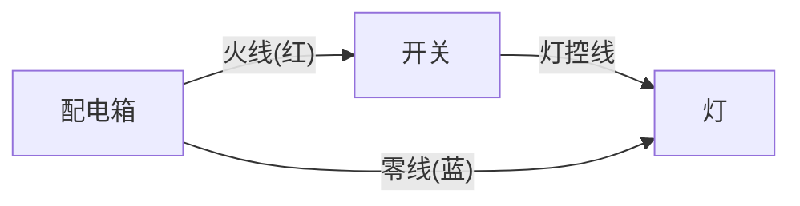
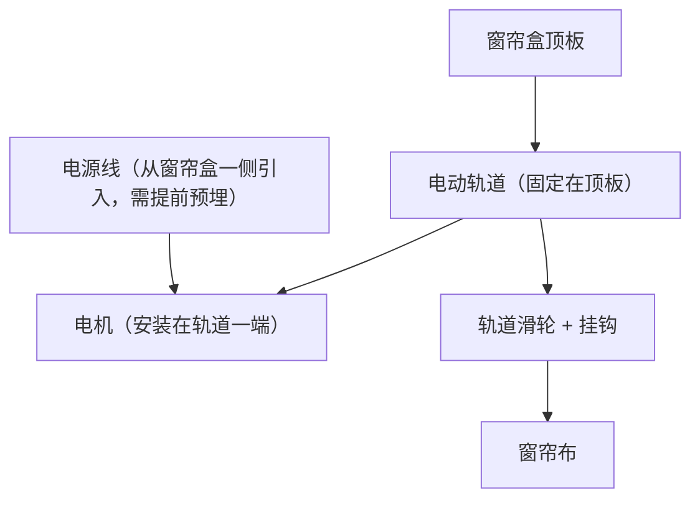
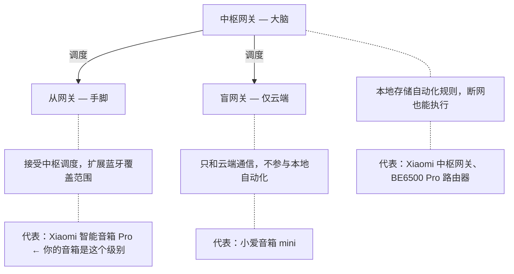
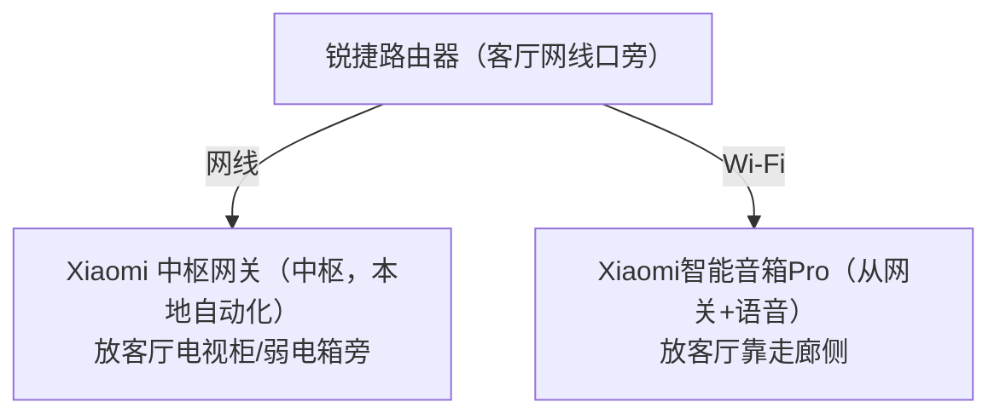
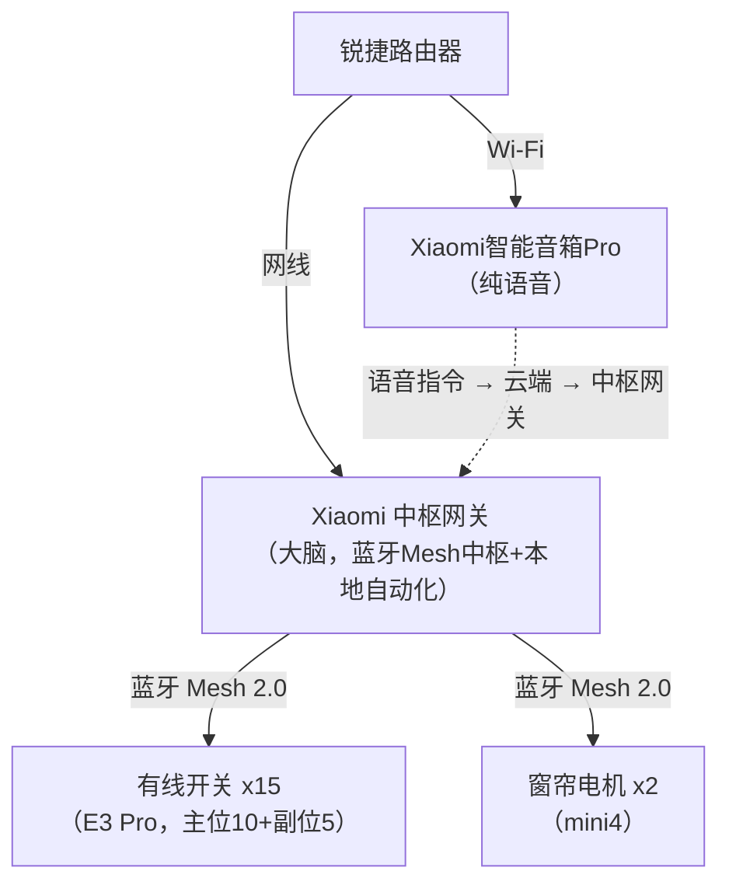

# 02 - 设备选型

## 一、智能开关：领普 LINPTECH

### 选型：E3 Pro 系列（零火版，蓝牙 Mesh 2.0，米家版）

::: tip 领普开关选购要点

**必须选：**
- E3 Pro 系列
- 零火版
- 米家版
- 蓝牙 Mesh 2.0

**不要选：**
- Q4（老款 Mesh 1.0）
- 单火版（你有零线不需要）
- HomeKit 版
- 涂鸦版 / 天猫精灵版

搜索关键词：`领普 E3 Pro 智能开关 零火 米家`
:::

### E3 Pro 的核心优势

::: info E3 Pro 核心优势

1. **AG 肤感玻璃面板** — 防指纹、防刮花、手感出色；和小米 Pro（109元）同级面板，价格不到一半
2. **6.5mm 超薄面板（业内最薄）** — 比传统开关更贴合墙面，视觉更简洁
3. **蓝牙 Mesh 2.0** — 响应速度比 1.0 提升 50%；组网时间降低 80%（约 4 秒配网）；支持远程 OTA 固件升级
4. **16A 继电器 + 2200W 负载** — 大功率灯具也能用
5. **单击/双击/长按 三种操作** — 一个按键可以绑定多个场景
:::

### 领普 2025 开关全线对比（帮你理解为什么选 E3 Pro）

|          | T1（极致低价） | E3S（性价比） | **E3 Pro（推荐）** | E5（带屏旗舰） |
|----------|---------------|--------------|-------------------|---------------|
| 面板     | PC塑料         | PC磨砂       | AG玻璃            | 纯平+OLED屏    |
| 厚度     | 6.9mm         | 6.9mm        | 6.5mm             | 6.9mm         |
| 协议     | Mesh2.0       | Mesh2.0      | Mesh2.0           | Mesh2.0+澎湃  |
| 单键(零火)| ~29元         | ~39元        | ~49元             | ~49元          |
| 双键     | ~39元          | ~49元        | ~59元             | ~65元          |
| 三键     | ~49元          | ~59元        | ~69元             | ~79元          |
| 键数选项  | 1-3键         | 1-4键        | 1-4键             | 1-4键          |
| **适合谁** | 极致省钱     | 单火用户      | **大多数人**       | 尝鲜玩家       |

为什么不选别的：
- **T1**：便宜但 PC 塑料手感差，只有1-3键
- **E3S**：和 E3 Pro 仅差 10 元/个，但面板从 AG 玻璃降为 PC 磨砂
- **E5**：2026.4 刚发布，带 OLED 屏很酷但评测太少，等稳定后再考虑
- **Q4**：老款 Mesh 1.0，已淘汰

### 和竞品的对比

|              | **领普 E3 Pro（选它）** | 小米智能开关 Pro    | Aqara 绿米          |
|--------------|----------------------|-------------------|-------------------|
| 单键价格      | ~49 元              | ~109 元(国补)      | ~65 元             |
| 双键价格      | ~59 元              | ~119 元(国补)      | ~75 元             |
| 三键价格      | ~69 元              | ~139 元(国补)      | ~85 元             |
| 面板材质      | AG 肤感玻璃          | AG 玻璃            | PC 塑料            |
| 通信协议      | 蓝牙 Mesh 2.0       | 蓝牙 Mesh 2.0     | Zigbee 3.0         |
| 需要网关      | Mesh网关/音箱        | Mesh网关/音箱       | Zigbee网关(+200元)  |
| HomeKit      | ✗                   | ✗                 | ✓                  |
| 性价比        | ★★★★★              | ★★★☆☆            | ★★★☆☆             |
| **总评**      | **同级面板半价**      | 品牌好但太贵        | 需额外网关，总成本高  |

> 你的情况：预算有限 + 米家生态 + 新装修有零线 → **领普 E3 Pro 是 2025 年最优选择**

### 单火版 vs 零火版：怎么选？

- **火线**：有电的线（电笔测试会亮）
- **零线**：回路的线（电笔测试不亮）
- **灯控线**：从开关到灯具的线（开关控制它通断来开关灯）

|              | 零火版（零线版）      | 单火版（单火线版）        |
|--------------|---------------------|------------------------|
| 底盒需要的线  | 火线 + 零线 + 灯控线  | 只要火线 + 灯控线        |
| 价格          | ~49-69 元(E3 Pro)   | 贵约 20 元              |
| 稳定性        | ★★★★★              | ★★★★☆                 |
| LED 灯兼容    | 完美兼容             | 低功率 LED 可能闪烁      |
| 发热          | 几乎不发热            | 轻微发热（正常）         |
| 待机功耗      | 极低                 | 略高（需要窃电维持工作）   |
| **适用场景**  | **新装修 / 有零线的老房** | 老房子底盒没零线       |

你家是新装修，电工已预留零线 → 全部选零火版 ✅
零火版更稳定、更便宜、不闪灯，没有任何理由选单火版。

### 键数怎么选？（单键 / 双键 / 三键 / 四键）

一个键控制一路灯。你家底盒里有几根灯控线，就选几键的开关。

::: tip 选键数的原则
- 底盒里有 **1** 根灯控线 → **单键**（控制 1 个灯/灯组）
- 底盒里有 **2** 根灯控线 → **双键**（控制 2 个灯/灯组）
- 底盒里有 **3** 根灯控线 → **三键**（控制 3 个灯/灯组）
- 底盒里有 **4** 根灯控线 → **四键**（少见，灯路特别多才用）
:::

::: warning 不要多买键数！
底盒里只有 1 根灯控线，买三键开关也只能用 1 个键，多出来的键按了没反应（除非当无线场景按钮用）
:::

::: details 怎么判断底盒里有几根灯控线？

**方法一：打开底盒面板，数一下线**
- 红色 1 根 → 火线（所有开关共用）
- 蓝色 1 根 → 零线（所有开关共用）
- 其他颜色 → 灯控线（有几根就是几路灯）

**方法二：看原来的旧开关是几键的**

旧开关几键 → 新开关就选几键（最简单的判断方式）
:::

你家各位置的键数规划：

| 位置   | 键数 | 原因                             |
|--------|------|----------------------------------|
| 客厅   | 三键 | 主灯 + 射灯 + 灯带，3 路灯        |
| 餐厅   | 单键 | 只有 1 个餐厅灯                   |
| 主卧   | 双键 | 主灯 + 氛围灯，2 路灯             |
| 卧室A  | 双键 | 主灯 + 辅灯，2 路灯               |
| 卧室B  | 双键 | 主灯 + 辅灯，2 路灯               |
| 厨房   | 单键 | 只有 1 个厨房灯（注意事项见下）     |
| 公卫   | 双键 | 顶灯 + 镜前灯，2 路灯             |
| 主卫   | 单键 | 只有 1 个顶灯                     |
| 走廊   | 单键 | 只有 1 个走廊灯                   |
| 阳台   | 单键 | 只有 1 个阳台灯                   |

::: warning 注意事项
- 以上按常见户型规划，实际以底盒里的灯控线数量为准！
- 厨房：如果有操作台灯带/橱柜灯 + 顶灯 = 2路，需改用双键（+10元）
- 主卫：如果有镜前灯改用双键（+10元）
- 装修时让电工确认每个底盒有几路灯控线，按实际选键数
:::

### 价格与规格

| 规格   | 参考价  | 适用场景                   |
|--------|---------|---------------------------|
| 单键版 | ~49 元  | 卫生间、阳台、走廊、餐厅     |
| 双键版 | ~59 元  | 卧室、公卫                  |
| 三键版 | ~69 元  | 客厅                       |
| 四键版 | ~79 元  | 灯路特别多的位置（少见）      |

- 购买平台推荐：小米有品 > 京东领普旗舰店 > 天猫领普旗舰店
- 面板颜色：白色最百搭，灰色适合深色/工业风装修（贵约 6 元）
- 售后：一年只换不修 + 一年价保

### 老人能用吗？对比传统开关

家里有老人，最怕的就是：「这个灯怎么开？」

| 对比项     | 传统开关           | 领普智能开关                 |
|-----------|-------------------|----------------------------|
| 物理按键   | 按下开/关 ✅       | 按下开/关 ✅（一模一样）      |
| 按键手感   | 机械翘板/弹簧      | 轻触面板，回弹清脆           |
| 外观       | 白色塑料翘板       | 白色 AG 玻璃面板，更简洁     |
| 开关大小   | 标准 86 型         | 标准 86 型（完全一样大）      |
| 需要联网吗 | 不需要             | 不需要（按键永远可用）        |
| 断电后     | 正常用             | 正常用（没电谁都不行）        |
| 学习成本   | 零                | 零（按就是了，没区别）        |

::: tip 关键结论：对老人来说，智能开关 = 传统开关
- 按一下开灯，再按一下关灯 → 和以前完全一样
- 不需要手机，不需要联网，不需要学任何东西
- 唯一区别：年轻人还能用手机/语音控制，老人完全无感

**不推荐的做法：**
- 用智能灯泡替代智能开关 → 老人按传统开关会断电，灯泡离线
- 用触摸屏开关 → 老人可能不习惯，找不到按键位置

**领普开关的优势：**
- 实体按键（不是触摸屏），手感明确
- 有指示灯（黑暗中也能找到开关位置）
- 按键面积大，老人不容易按错
:::

---

## 二、双控方案：两边都装有线 E3 Pro

### 为什么不用无线开关？

::: info
你家新装修，所有双控底盒（包括副位/床头）都预留了火线和零线。
- 两边都装有线 E3 Pro，手感一致、AG 玻璃面板、有线直控更稳定。
- 不需要无线开关（K9B），省去蓝牙联动的偶发延迟。

如果你家副位底盒没有火线零线（老房改造常见），才需要用无线开关方案，详见 → 07-switch-types.md
:::

### 双控位置规划

| 位置   | 主位（门口）        | 副位（床头/远端）      | 副位价格 |
|--------|--------------------|-----------------------|---------|
| 客厅   | 门口 三键 E3 Pro   | 走廊入口 三键 E3 Pro   | 69 元   |
| 主卧   | 门口 双键 E3 Pro   | 床头 双键 E3 Pro       | 59 元   |
| 卧室A  | 门口 双键 E3 Pro   | 床头 双键 E3 Pro       | 59 元   |
| 卧室B  | 门口 双键 E3 Pro   | 床头 双键 E3 Pro       | 59 元   |
| 走廊   | 一端 单键 E3 Pro   | 另一端 单键 E3 Pro     | 49 元   |
| **副位合计** | —            | **5 个**              | **295 元** |

副位开关和主位一模一样：AG 玻璃面板、物理按键、Mesh 2.0。两边手感完全一致，比无线开关体验好。

### 双控联动配置

两个有线开关控制同一个灯，通过米家 App 设置联动：

::: tip 方式一：副位开关通过自动化联动主位（推荐，最简单）
米家 App → 智能 → 新建自动化

- **触发条件**：副位开关（床头）→ 键1 单击
- **执行动作**：主位开关（门口）→ 键1 切换状态

这样按床头开关 = 按门口开关，效果一模一样
:::

**方式二：两个开关各接一路灯控线到同一个灯（需电工配合）**
- 让电工确认是否可行，取决于灯控线的走向
- 如果可行，不需要 App 联动，物理层面双控

---

## 三、窗帘电机：科创者 mini4

### 为什么不选领普窗帘电机？

::: info
领普的开关很强，但窗帘电机不是它的强项：
- 领普窗帘电机市场存在感低，用户评价稀少
- 电机形态偏旧，噪音数据未标注
- 同价位有更好的选择

科创者 mini4 是 2025 年天猫窗帘电机销量第一（市占率 45%+），支持蓝牙 Mesh 2.0 接入米家，和领普开关完全兼容。
:::

### 推荐：科创者 mini4（蓝牙 Mesh 2.0 版）

| 设备               | 参考价      | 说明                                                        |
|--------------------|------------|-------------------------------------------------------------|
| 科创者 mini4 + 轨道 | ~350 元/套  | 无刷直流电机，21dB 静音；2.0 N.m 扭矩，200斤承重；蓝牙Mesh 2.0，接入米家；10年换新质保 |
| **合计**            | **2套 ~700元** | 阳台 + 主卧各一套                                           |

- 搜索关键词：`科创者 mini4 电动窗帘 电机轨道套装 米家`
- 购买平台：天猫 > 京东 > 淘宝（轨道定制）

### 窗帘电机对比

|              | **科创者 mini4（推荐）** | 杜亚 real5   | 小米官方       |
|--------------|------------------------|-------------|---------------|
| 电机类型      | 无刷直流               | 有刷         | 双模           |
| 噪音         | 21dB                   | 20.7dB      | 未标注         |
| 扭矩         | 2.0 N.m                | 1.2 N.m     | 未标注         |
| 承重         | 200斤                  | 50kg        | 未标注         |
| 质保         | 10年换新                | 5年         | 常规           |
| 轨道材质      | 铝镁合金               | 铝合金       | 未标注         |
| 套装价格      | ~350 元                | ~500 元     | ~500 元        |
| 米家接入      | Mesh 2.0 ✅            | 需确认       | ✅             |
| **总评**      | **性能+性价比综合最优**  | 老牌稳定     | 原生兼容但性价比一般 |

### 窗帘系统结构

### 轨道选型注意事项

::: tip 轨道选型注意

**轨道材质**：必选铝合金（6063-T5 最佳），壁厚 ≥ 1.5mm。不要选塑料轨道，耐用性只有铝合金的 1/3。

**直轨 vs 弯轨**：
- 阳台落地窗一字排开 → 直轨
- 有 L 型拐角 → 弯轨（贵一些，窗帘盒需加宽 5cm）
- 主卧普通窗户 → 直轨

**量尺方法**：轨道长度 = 窗户净宽 + 两侧各延伸 15-20cm。例：窗户净宽 3m → 轨道订 3.3-3.4m。多留 5cm 余量（可以裁短不能加长）。

下单时备注轨道长度，商家按尺寸定制裁切。
:::

### 你家的窗帘安装位置

你家需要装电动窗帘的位置：

| 位置 | 面积 | 说明 | 安装 |
|------|------|------|------|
| 阳台窗帘 | 9.2㎡ | 大面积落地窗 | ✅ |
| 主卧窗帘 | 17.7㎡ | 起床自动开帘刚需 | ✅ |

其他位置不需要电动窗帘（后期觉得需要可以加装）。

---

## 四、中枢网关 + 语音音箱

### 为什么需要中枢网关？

| 对比项     | 没有网关（仅手机蓝牙） | 有中枢网关           |
|-----------|---------------------|-------------------|
| 在家控制   | ✅                  | ✅                 |
| 远程控制   | ✗                   | ✅                 |
| 定时自动化 | ✗                   | ✅（本地执行，断网可用） |
| 语音控制   | ✗                   | ✅（需搭配音箱）     |
| 智能场景   | ✗                   | ✅（本地执行，断网可用） |

### 中枢网关方案

使用独立的 Xiaomi 中枢网关作为全屋大脑，音箱不承担网关职责，只负责语音唤起。

| 方案                    | 参考价   | 特点                                              |
|-------------------------|---------|--------------------------------------------------|
| **Xiaomi 中枢网关（选它）** | ~250 元 | 本地自动化 + 蓝牙Mesh 2.0 中枢 + RJ45网口 + 300台设备 |
| 小米BE6500Pro路由         | ~500 元 | 路由+中枢网关+Mesh网关三合一；适合重度用户，预算要求高    |

### 语音音箱方案

音箱只负责语音唤起，不参与设备连接和自动化调度。

| 方案                    | 参考价   | 特点                                              |
|-------------------------|---------|--------------------------------------------------|
| **Xiaomi智能音箱Pro（推荐）** | ~270 元 | 超级小爱大模型 + 红外控制空调电视；6麦阵列10米拾音，音质好 |
| Xiaomi智能音箱（预算紧选它）   | ~199 元 | 超级小爱，无红外                                    |

::: warning 注意区分
- "Xiaomi智能音箱Pro"（新款，2025.2，推荐） ← 搜这个
- "小爱音箱Pro"（老款，Mesh 1.0，不推荐）
:::

### 语音覆盖方案

| 方案           | 预算    | 配置                                                     |
|---------------|---------|----------------------------------------------------------|
| **推荐方案（够用）** | +65 元 | 客厅：Xiaomi智能音箱Pro（语音）；主卧：小爱音箱 mini（~65元，纯语音）→ 两个最常用的位置都能语音控制 |
| 省钱方案（也够用）   | +0 元  | 只买 Xiaomi智能音箱Pro 放客厅；客厅喊一嗓子，卧室靠手机或按键 |

- 不需要在客厅额外加 mini —— Pro 本身就放在客厅。
- 路由器建议固定 2.4GHz 信道，减少干扰，小爱音箱用 2.4G 连接更稳定。

---

## 五、过道夜灯：米家夜灯 2

::: info 米家夜灯 2
过道已预留插座 → 直接插一个米家夜灯 2

- **价格**：~30 元
- **功能**：光感 + 人体感应，天黑自动亮、人走自动灭
- **接入**：米家 App，可设置亮度和感应灵敏度
- 不占开关位，不需要改任何线路
- 搜索：`米家夜灯2`
:::

---

## 六、浴霸说明

::: warning 浴霸不用智能开关控制！
浴霸是信号线控制（5线或6线），不是简单的通断控制。普通智能开关无法替代浴霸专用面板。

- **方案1**：买普通浴霸 → 保留浴霸自带的控制面板
- **方案2**：买米家智能浴霸（如 Yeelight 智能浴霸）→ 自带蓝牙控制面板，接入米家，可语音控制

总之：浴霸走独立控制，和智能开关方案互不影响。
:::

---

## 七、中枢网关：Xiaomi 中枢网关（第一批购入）

### 音箱 Pro 不是中枢网关！

::: warning 很多人以为音箱 Pro 就是中枢网关，这是误解！音箱只负责语音唤起，中枢网关才是全屋大脑。
:::

米家网关分三级：

音箱 Pro 能做蓝牙 Mesh 2.0 网关连接设备，但自动化场景的执行依赖云端 → 断网就废。只有中枢网关才能实现本地自动化。

### 中枢网关能做什么音箱 Pro 做不到的事？

| 能力              | 音箱 Pro（从网关）  | 中枢网关               |
|-------------------|-------------------|----------------------|
| 蓝牙 Mesh 2.0    | 支持               | 支持                  |
| 断网后自动化执行   | ❌ 不支持           | ✅ 支持（核心价值）     |
| 本地自动化(不走云) | ❌ 不支持           | ✅ 支持（响应更快）     |
| 极客版自动化编程   | ❌ 不支持           | ✅ 支持（高级逻辑）     |
| 有线网口          | 无                 | 有 RJ45               |
| 设备连接数        | 50-100 台          | 300 台                |
| 语音控制          | ✅ 支持             | ❌ 无                 |
| 价格             | ~270 元（已有）      | ~250 元（额外买）      |

::: info 本地自动化的实际意义
场景：人体传感器检测到人 → 自动开灯

- **没有中枢**：传感器 → 云端 → 开关（0.5-1秒延迟，断网失效）
- **有中枢**：传感器 → 中枢 → 开关（几乎无感延迟，断网可用）

对开关+窗帘：感知不大（手动控制为主）。对传感器联动：差异巨大（自动触发需要快速响应）。
:::

### 推荐型号：Xiaomi 中枢网关（ZSWG01CM）

| 设备                      | 参考价            | 说明                                      |
|--------------------------|-------------------|------------------------------------------|
| Xiaomi 中枢网关 ZSWG01CM  | ~250 元（大促可到210） | 唯一在售的独立中枢网关；本地自动化 + 极客版编程；300台设备连接 + RJ45网口 |

- 搜索关键词：`Xiaomi 中枢网关`
- 购买时机：建议等 618/双11 大促，历史低价 210 元左右

### 中枢网关怎么部署？

你家用锐捷路由器，中枢网关单独买，部署方式：

::: info 三者各司其职
- **中枢网关** — 大脑：蓝牙 Mesh 2.0 中枢 + 本地自动化 + 调度所有设备
- **音箱 Pro** — 嘴巴：纯语音唤起，不承担网关职责
- **小爱 mini** — 补充：主卧语音唤起
:::

::: warning 关键注意事项
- 中枢网关必须用网线连路由器（不要用 Wi-Fi，2.4GHz 会干扰蓝牙）
- 中枢网关和路由器保持 1 米以上距离（减少蓝牙干扰）
- 中枢网关和音箱 Pro 不要放一起（分开放，扩大蓝牙覆盖范围）
:::

### 什么时候买？

::: tip 第一批就买，一步到位
中枢网关是全屋智能的大脑，从一开始就应该到位：
- 蓝牙 Mesh 2.0 中枢，所有设备通过中枢网关连接
- 本地自动化，断网也能执行场景
- 音箱只负责语音，不承担网关职责

大促价 ~210 元，日常 ~250 元。
:::

---

## 八、传感器建议（第二批购入）

::: tip
建议先把开关+窗帘+场景跑通，住进去 1-2 周后再决定哪些位置真的需要传感器。传感器是锦上添花，不是必需品。
:::

### 推荐传感器位置

| 位置          | 推荐传感器          | 参考价  | 作用                                                     |
|--------------|--------------------|---------|---------------------------------------------------------|
| 公卫（强烈推荐）| 领普 ES5 人体存在传感器 | ~59 元 | 进门自动开灯，人走自动关灯；24G雷达能感知静坐不动的人 → 坐马桶上灯不会灭！ |
| 主卫（推荐）   | 领普 ES5 人体存在传感器 | ~59 元 | 同上，洗澡时灯不会灭                                      |
| 走廊（推荐）   | 小米人体传感器2       | ~45 元 | 经过走廊自动开灯；配合延迟 60 秒自动关灯；走廊不需要"存在感知"，普通够用 |
| 入户门（可选） | 小米门窗传感器        | ~40 元 | 开门自动触发"回家模式"；比 NFC 贴纸更自动化                  |

传感器总预算：约 200 元（公卫+主卫+走廊+入户门全配）

### 人体传感器 vs 人体存在传感器

::: warning 这两个是完全不同的东西！选错了体验天差地别

**人体传感器**（PIR 红外，~45元）
- 只能检测「人在动」→ 人坐着不动就检测不到
- 适合走廊、过道等「经过就走」的场景
- 不适合卫生间（坐马桶上灯会灭）

**人体存在传感器**（毫米波雷达，~59-150元）
- 能检测「人在」→ 静坐、睡觉、洗澡都能感知
- 适合卫生间、书房等「长时间停留」的场景
- 领普 ES5 用 24G 雷达+红外+光感三合一，59元性价比很高

**选购原则**：卫生间 → 必须用存在传感器（ES5）；走廊/过道 → 普通人体传感器就够（小米人体传感器2）
:::

### 传感器搜索关键词

- `领普 ES5 人体存在传感器 米家`
- `小米人体传感器2 蓝牙Mesh`
- `小米门窗传感器 蓝牙`

---

## 九、设备总览

**第一批（装修时安装）**
| 设备 | 数量 | 型号 |
|------|------|------|
| 有线开关 | 15 个 | 领普 E3 Pro（主位10+双控副位5） |
| 窗帘电机 | 2 个 | 科创者 mini4（阳台+主卧） |
| 中枢网关 | 1 个 | Xiaomi 中枢网关（大脑，蓝牙Mesh中枢+本地自动化） |
| 语音音箱 | 1 个 | Xiaomi智能音箱Pro（纯语音） |
| 语音音箱 | 1 个 | 小爱 mini（主卧，可选） |
| 夜灯 | 1 个 | 米家夜灯2（走廊插座） |
| 辅材 | — | 电笔/螺丝刀/胶布 |

> 第一批设备数：21 个 | 预算：~2,240 元

**第二批（住进去 1-2 周后，传感器）**
| 设备 | 数量 | 型号 |
|------|------|------|
| 人体存在 | 2 个 | 领普 ES5（公卫+主卫） |
| 人体传感 | 1 个 | 小米人体传感器2（走廊） |
| 门窗传感 | 1 个 | 小米门窗传感器（入户门） |

> 第二批设备数：4 个 | 预算：~200 元

> **全部到位后总设备数：25 个 | 总预算：~2,440 元**
>
> 中枢网关从第一批就买，一步到位，不用分两批折腾。
