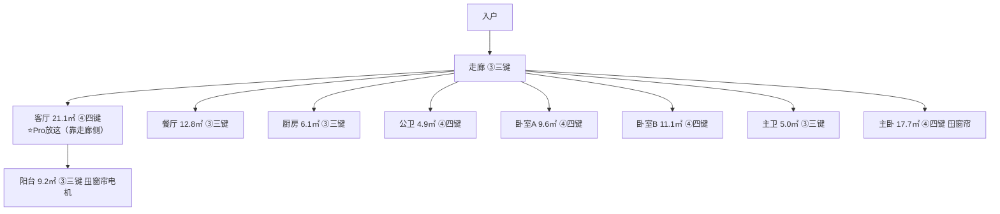
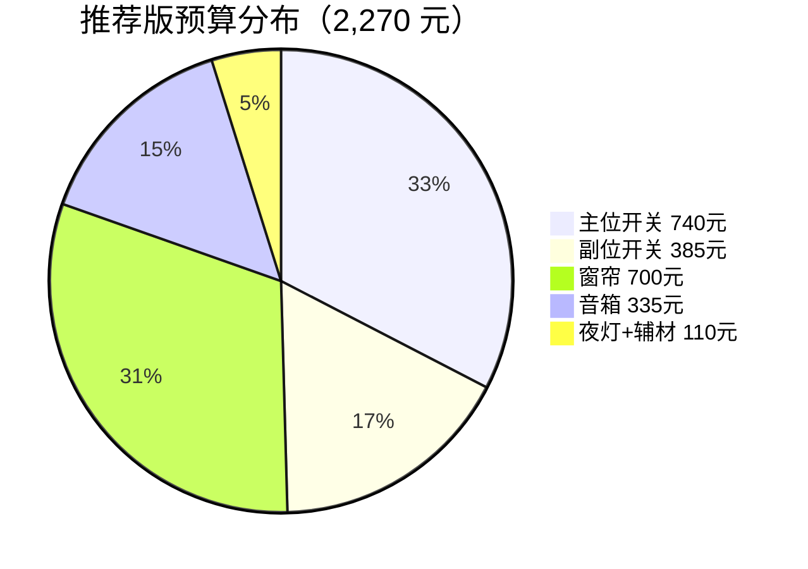

# 03 - 采购清单

## 按房间规划

### 户型平面示意（参照 home.jpg 实际户型）

> 按你家实际户型绘制。图例：③④ = 开关购买键数（含场景键），🪟 = 窗帘电机，⭐ = Xiaomi智能音箱Pro推荐位置
> 多键策略：实际灯路+多余键当场景按钮，后期转智能灯可玩性更高

> 按你家实际户型绘制。三室一厅一餐厅，1 公卫 + 1 主卫。

---

## 完整采购清单

### 第一批：智能开关（领普 E3 Pro 零火版）

::: tip 多键策略：多出来的键当场景按钮
所有开关统一"多买键"：实际灯路用掉的键控制灯，多出来的键通过米家 App 绑定为场景按钮（全屋关灯、睡眠模式、回家/离家等）。后期转智能灯后，开关变为纯无线场景控制器，可玩性更高。
- 一开（1路灯）→ 买 **三键**，多 2 个场景键
- 两开（2路灯）→ 买 **四键**，多 2 个场景键
- 三开（3路灯）→ 买 **四键**，多 1 个场景键
:::

| # | 位置 | 实际灯路 | 购买键数 | 多出场景键 | 数量 | 单价(元) | 小计(元) |
|---|------|----------|---------|-----------|------|----------|----------|
| 1 | 客厅 | 3路（主灯+射灯+灯带） | 四键 | +1 | 1 | 79 | 79 |
| 2 | 餐厅 | 1路（餐厅灯） | 三键 | +2 | 1 | 69 | 69 |
| 3 | 主卧 | 2路（主灯+氛围灯） | 四键 | +2 | 1 | 79 | 79 |
| 4 | 卧室A | 2路（主灯+辅灯） | 四键 | +2 | 1 | 79 | 79 |
| 5 | 卧室B | 2路（主灯+辅灯） | 四键 | +2 | 1 | 79 | 79 |
| 6 | 厨房 | 1路（厨房灯） | 三键 | +2 | 1 | 69 | 69 |
| 7 | 公卫 | 2路（顶灯+镜前灯） | 四键 | +2 | 1 | 79 | 79 |
| 8 | 主卫 | 1路（顶灯） | 三键 | +2 | 1 | 69 | 69 |
| 9 | 走廊 | 1路（走廊灯） | 三键 | +2 | 1 | 69 | 69 |
| 10 | 阳台 | 1路（阳台灯） | 三键 | +2 | 1 | 69 | 69 |
| | | | | **合计** | **10个** | | **740** |

> 搜索关键词：`领普 E3 Pro 智能开关 零火 米家`
> 比按实际灯路选键数多花 190 元（550→740），换来 **18 个可编程场景按钮**

### 第一批：双控副位开关（领普 E3 Pro 零火版）

| # | 位置 | 实际灯路 | 购买键数 | 多出场景键 | 数量 | 单价(元) | 小计(元) |
|---|------|----------|---------|-----------|------|----------|----------|
| 1 | 客厅（走廊入口） | 3路 | 四键 | +1 | 1 | 79 | 79 |
| 2 | 主卧（床头） | 2路 | 四键 | +2 | 1 | 79 | 79 |
| 3 | 卧室A（床头） | 2路 | 四键 | +2 | 1 | 79 | 79 |
| 4 | 卧室B（床头） | 2路 | 四键 | +2 | 1 | 79 | 79 |
| 5 | 走廊（远端） | 1路 | 三键 | +2 | 1 | 69 | 69 |
| | | | | **合计** | **5个** | | **385** |

> 所有双控底盒都有火线+零线 → 两边都装有线 E3 Pro，手感一致、更稳定
> 和主位用同一个型号、同一个搜索关键词：`领普 E3 Pro 智能开关 零火 米家`
> 副位多出来的场景键特别适合绑定"睡眠模式""全屋关灯"等高频场景

### 第一批：窗帘电机（科创者 mini4）

| # | 位置 | 设备 | 数量 | 单价(元) | 小计(元) |
|---|------|------|------|----------|----------|
| 1 | 阳台 | 电机 + 轨道套装 | 1 | 350 | 350 |
| 2 | 主卧 | 电机 + 轨道套装 | 1 | 350 | 350 |
| | | | **合计** | | **700** |

> 搜索关键词：`科创者 mini4 电动窗帘 电机轨道套装 米家`
> 下单时备注轨道长度（窗户净宽 + 两侧各 15-20cm）

### 第一批：中枢网关 + 语音音箱

| # | 设备 | 位置 | 数量 | 单价(元) | 小计(元) |
|---|------|------|------|----------|----------|
| 1 | Xiaomi智能音箱Pro（Mesh 2.0 网关） | 客厅靠走廊侧 | 1 | 270 | 270 |
| 2 | 小爱音箱 mini（可选，纯语音） | 主卧 | 1 | 65 | 65 |

> 搜索关键词：`Xiaomi智能音箱Pro`（注意不是"小爱音箱Pro"老款）
> Pro 是必买的（网关功能）。mini 是为了主卧语音覆盖，不买不影响使用。

### 第一批：夜灯

| # | 设备 | 位置 | 数量 | 单价(元) | 小计(元) |
|---|------|------|------|----------|----------|
| 1 | 米家夜灯 2 | 走廊插座 | 1 | 30 | 30 |

> 光感+人体感应，天黑自动亮，插上就用

### 第一批：辅材与工具

| # | 物品 | 是否必需 | 单价(元) | 说明 |
|---|------|----------|----------|------|
| 1 | 电笔/测电笔 | 必需 | 15-30 | 区分火线零线，安全必备 |
| 2 | 十字+一字螺丝刀 | 必需 | 10-20 | 拆装底盒面板和接线端子 |
| 3 | 剥线钳 | 推荐 | 15-25 | 处理线头（用剪刀也行但不推荐） |
| 4 | 绝缘胶布 | 必需 | 5 | 包裹接线处 |
| 5 | 空白面板(86型) | 视情况 | 5-8/个 | 封住弃用的双控底盒（约需5个） |
| | | **辅材合计** | **～80 元** | |

> 零火版不需要消闪器（消闪器是单火版专用）。
> 不需要买加深底盒（新装修让电工直接用 ≥50mm 深底盒）。

---

## 预算汇总

| 类别                  | 数量   | 金额      |
|-----------------------|--------|----------|
| 领普 E3 Pro 主位开关（多键版） | 10 个  | 740 元   |
| 领普 E3 Pro 副位开关（多键版） | 5 个   | 385 元   |
| 科创者 mini4 窗帘套装  | 2 套   | 700 元   |
| Xiaomi智能音箱Pro      | 1 台   | 270 元   |
| 米家夜灯 2             | 1 个   | 30 元    |
| 辅材工具               | 若干   | 80 元    |
| **基础版总计**         | —      | **2,205 元** |
| + 小爱 mini（可选）    | 1 台   | + 65 元  |
| **推荐版总计**         | —      | **2,270 元** |

> 多键策略比按实际灯路选键数多花 280 元（1,990→2,270），换来全屋 **28 个可编程场景按钮**

### 第二批：中枢网关 + 传感器（住进去后一起买）

| # | 设备 | 位置 | 数量 | 单价(元) | 小计(元) |
|---|------|------|------|----------|----------|
| 1 | **Xiaomi 中枢网关** | 客厅（网线连路由器） | 1 | 250 | 250 |
| 2 | 领普 ES5 人体存在传感器 | 公卫 | 1 | 59 | 59 |
| 3 | 领普 ES5 人体存在传感器 | 主卫 | 1 | 59 | 59 |
| 4 | 小米人体传感器 2 | 走廊 | 1 | 45 | 45 |
| 5 | 小米门窗传感器 | 入户门 | 1 | 40 | 40 |
| | | | **合计** | | **453** |

> 中枢网关 + 传感器建议一起买，传感器联动需要中枢网关的本地自动化才快。
> 等 618/双11 大促，中枢网关历史低价约 210 元。
> 搜索：`Xiaomi 中枢网关`
>
> 中枢网关必须用网线连路由器（不要用Wi-Fi），和路由器保持1米以上距离。
> 公卫/主卫必须用存在传感器（坐着不动也能感知），走廊用普通人体传感器就够。

---

## 购买渠道建议

| 渠道   | 建议                                     |
|--------|------------------------------------------|
| 小米有品 | 领普首发渠道，新品价格最优                  |
| 京东   | 领普旗舰店 / 科创者旗舰店，物流快售后方便    |
| 天猫   | 618/双11 有活动，大促时集中采购             |
| 淘宝   | 窗帘轨道定制在淘宝买更划算（量尺下单）       |
| 拼多多 | 百亿补贴偶尔有低价，注意选官方店             |
| 闲鱼   | 不建议，开关这类东西买新的保险               |

## 搜索关键词汇总

| 品类     | 搜索关键词                                    |
|----------|----------------------------------------------|
| 开关     | `领普 E3 Pro 智能开关 零火 米家`（主位+副位同型号） |
| 窗帘     | `科创者 mini4 电动窗帘 电机轨道套装 米家`           |
| 网关音箱 | `Xiaomi智能音箱Pro`                              |
| 语音音箱 | `小爱音箱 mini`                                   |
| 夜灯     | `米家夜灯2`                                      |
| 中枢网关 | `Xiaomi 中枢网关`                                 |
| 传感器   | `领普 ES5 人体存在传感器 米家` / `小米人体传感器2 蓝牙Mesh` / `小米门窗传感器 蓝牙` |
