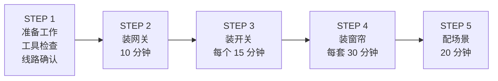
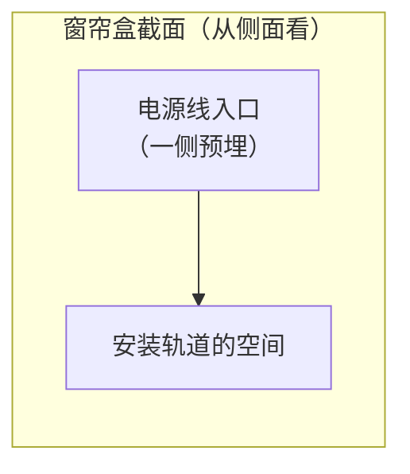
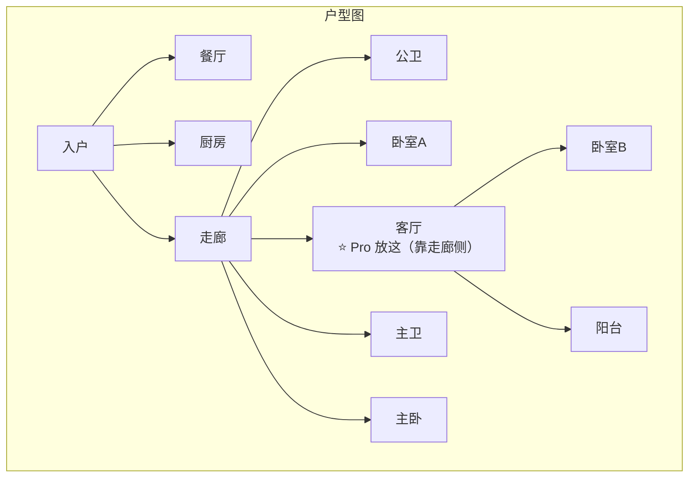
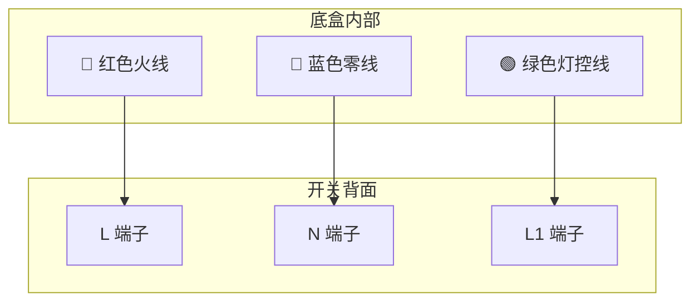
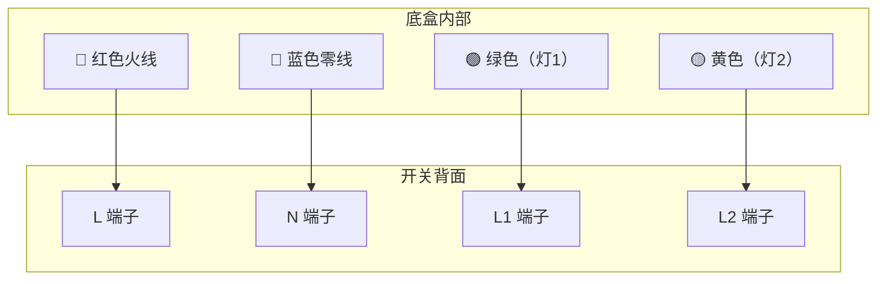
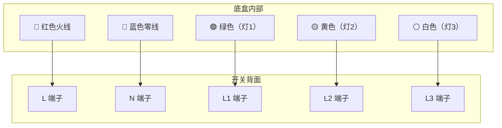
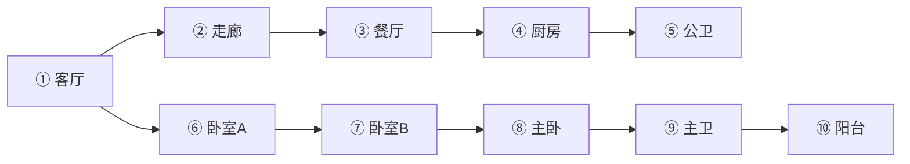
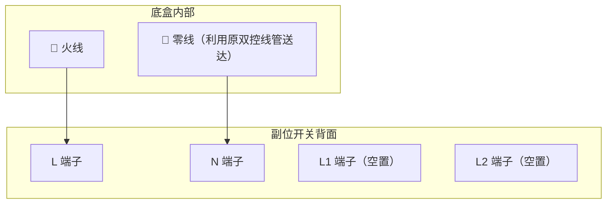
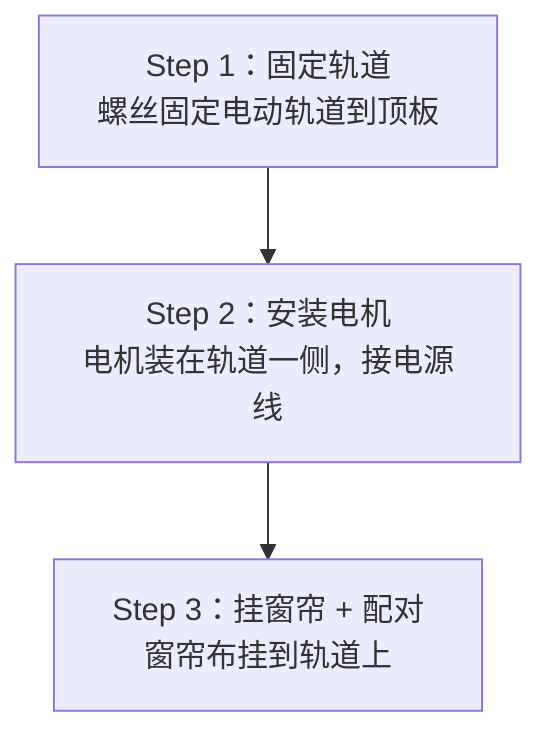

# 04 - 安装教程

## 施工总流程

---

## STEP 1：施工前准备

### 工具清单

::: tip 必备工具
| 工具 | 用途 |
|------|------|
| 🔧 十字螺丝刀 | 拆装底盒面板 |
| 🔧 一字螺丝刀 | 接线端子 |
| ⚡ 电笔/万用表 | 区分火线零线 |
| ✂️ 剥线钳 | 处理线头 |
| 📱 手机 | 米家 App 已安装 |
:::

### 确认底盒接线

打开每个底盒的盖板，确认线材：

::: info 86 底盒内部示意（从正面看）
| 线材 | 颜色 | 说明 |
|------|------|------|
| 🔴 火线 (L) | 红色 | 1 根 |
| 🔵 零线 (N) | 蓝色 | 1 根（你已预留 ✅） |
| 🟢 灯控线1 (L1) | 绿/黄/其他色 | 第一路灯 |
| 🟡 灯控线2 (L2) | — | 第二路灯（双键及以上才有） |
| ⚪ 灯控线3 (L3) | — | 第三路灯（三键才有） |
:::

::: warning 如果分不清哪根是火线哪根是零线
- 用电笔测试：亮的是火线，不亮的是零线
- 不确定就找电工帮忙，安全第一
:::

### 窗帘盒检查

::: tip 需要确认
- ✅ 窗帘盒一侧有预埋的电源线（火线+零线）
- ✅ 窗帘盒宽度 ≥ 12cm（能放下电机）
- ❌ 如果没有电源线 → 让电工加一路，这是唯一额外布线
:::

---

## STEP 2：安装中枢网关（小爱音箱）

耗时：约 10 分钟

**1. 选择位置（重要！）**

你家实际户型（参照 home.jpg）：

- ⭐ Xiaomi智能音箱Pro（网关）→ 放客厅靠走廊一侧（Mesh 2.0 覆盖全屋）
- 💡 小爱 mini（可选）→ 放主卧（纯语音，躺床上控制灯和窗帘）

**2. 插电 → 等待启动**

**3. 手机操作：**

米家 App → 右上角「+」→ 搜索音箱型号 → 连接 Wi-Fi → 完成

**4. 验证成功：**

说「小爱同学，你好」→ 有回应 = 搞定

---

## STEP 3：安装智能开关

### ⚡ 安全警告

::: danger 操作前必须断电！！！
1. 去配电箱，关掉对应回路的空气开关
2. 用电笔确认底盒内确实没电
3. 确认无误后再动手
:::

### 接线图解

**单键开关接线：**

开关背面（领普 E3S/T1 单键零线版）：

接法：

| 端子 | 接线 |
|------|------|
| L | ← 红色火线 |
| N | ← 蓝色零线 |
| L1 | ← 绿色灯控线 |

**双键开关接线：**

开关背面（领普 E3S/T1 双键零线版）：

接法：

| 端子 | 接线 |
|------|------|
| L | ← 红色火线 |
| N | ← 蓝色零线 |
| L1 | ← 绿色（第一路灯，如主灯） |
| L2 | ← 黄色（第二路灯，如辅灯） |

**三键开关接线：**

开关背面（领普 E3S/T1 三键零线版）：

接法：

| 端子 | 接线 |
|------|------|
| L | ← 红色火线 |
| N | ← 蓝色零线 |
| L1 | ← 绿色（如客厅主灯） |
| L2 | ← 黄色（如射灯） |
| L3 | ← 白色（如灯带） |

### 接线错误警告

::: danger 常见致命错误（可能烧开关甚至引发火灾）

**错误1：火线零线接反**
- L 端子 ← 接了蓝色零线 → ❌ 烧开关
- N 端子 ← 接了红色火线 → ❌ 触摸漏电风险
- **正确做法**：用电笔确认，亮的接 L，不亮的接 N

**错误2：灯控线接到 N（零线）端子**
- 灯控线接到了 N → 灯常亮，开关无法控制，甚至短路跳闸
- **正确做法**：灯控线只能接 L1/L2/L3

**错误3：底盒塞线过多导致短路**
- 线头裸露部分互相接触 → 短路跳闸
- 暴力塞入导致接线松动 → 接触不良/打火
- **正确做法**：线头拧紧插入端子，多余线缆整理折叠后再推入底盒

**错误4：带电操作**
- 没断空开就拆接线 → 触电！
- **正确做法**：先去配电箱关闭对应回路，电笔验电后再操作
:::

### 电工布线 Checklist

安装前请逐项确认（可截图给电工核对）：

- [ ] 每个底盒是否都有零线（蓝色）？
  - 没有零线 = 必须选单火版开关（贵约30元），或让电工补零线
- [ ] 每个底盒的火线是否只有一根？
  - 多根红线可能是串联到其他底盒的，不要随意拆断
- [ ] 灯控线数量是否和开关键数匹配？
  - 三键开关需要 3 根灯控线（L1/L2/L3）
  - 如果只有 2 根灯控线，只能装双键开关
- [ ] 底盒深度是否 ≥ 21mm？
  - T1/E3S/E3 Pro 底壳 21mm，老房子底盒如果太浅需要换深底盒
- [ ] 双控位置是否已确认处理方案？
  - 参考 07-switch-types.md 的方案一（两边都装有线 E3 Pro）
- [ ] 是否有串联底盒（一根火线穿过多个底盒）？
  - 串联底盒断电后需要确认所有串联位置一起处理

::: tip 给电工的沟通要点
1. "所有底盒都需要预留零线（包括双控副位！）"
2. "每个底盒内线头需要剥出约 8-10mm"
3. "双控位置两边都装智能开关，主位接灯线，副位只接火线零线"
4. "双控副位的零线利用原双控线管从主位送过去"
5. "灯控线统一接到主位底盒（门口），如果原来从副位出去需要改线"
6. "窗帘盒需要预留一路电源线（火线+零线）"
7. "底盒深度不够的地方需要换加深底盒"
:::

### DIY 还是请电工？

::: tip 适合 DIY 自己动手的情况
- ✅ 单控位置的一换一替换（旧开关 → 新智能开关）
- ✅ 底盒线路清晰（颜色分明、有标记）
- ✅ 你会用电笔、知道怎么断电
- ✅ 无线开关的安装（纯粘贴，无接线）
:::

::: warning 建议请电工的情况
- ❌ 双控改造（需要改线路走向）
- ❌ 底盒内线多且颜色混乱
- ❌ 需要补零线或换底盒
- ❌ 串联底盒（一根火线穿多个底盒）
- ❌ 你从没碰过电线（安全第一）
:::

::: details 电工费用参考
| 项目 | 费用 |
|------|------|
| 单个开关安装 | 15-30 元/个 |
| 全屋 10 个开关 | 150-300 元（可谈打包价） |
| 双控改造 | 50-80 元/组 |
| 补零线 | 100-200 元/路（需要从配电箱拉线） |

💡 **省钱建议**：请电工只做改线 + 接线，配对入网、App 设置自己来（这才是最耗时间的部分）
:::

### 安装详细步骤

### 配对入网

开关通电后（指示灯亮起）：

::: info 米家 App 操作步骤
1. 右上角「+」→ 自动发现新设备
2. 点击领普开关 → 确认添加
3. 选择房间（如「客厅」）
4. 给每个按键命名：
   - 键1 → 「客厅主灯」
   - 键2 → 「客厅射灯」
   - 键3 → 「客厅灯带」
5. 按一下开关试试 → 灯亮了 = 成功 ✅
:::

::: warning 搜不到设备？
- 长按开关任意键 10 秒进入配对模式（指示灯快闪）
- 再次搜索
:::

### 安装顺序

建议按以下顺序逐个房间安装（装一个配一个）：

::: tip
先装客厅（网关就在这）和走廊的开关。客厅+走廊在房屋中间，作为 Mesh 中继，让后面右侧卧室区和左侧阳台的设备配对更顺畅。
:::

---

## STEP 3.5：安装双控副位有线开关

> 双控位置两边都装有线 E3 Pro，副位只接火线+零线（不接灯线），通过米家联动控制主位

### 副位开关接线

副位开关不接灯线，只接火线和零线供电：

::: warning 副位接线要点
- 只接 L（火线）和 N（零线），L1/L2/L3 端子全部空置
- 零线通过原双控线管从主位送到副位底盒（让电工处理）
- 原来的双控线：一根改接零线，一根废弃（电工胶带包好）
:::

### 副位联动配置

以主卧为例（门口主控 + 床头副控，都是四键 E3 Pro）：

米家 App → 智能 → + 手动场景/自动化

::: details 自动化1：键1 联动主灯
- **如果**：副位开关（床头）→ 键1 单击
- **就**：主位开关（门口）→ 键1 切换状态
:::

::: details 自动化2：键2 联动辅灯
- **如果**：副位开关（床头）→ 键2 单击
- **就**：主位开关（门口）→ 键2 切换状态
:::

::: details 自动化3：键3 睡眠模式
- **如果**：副位开关（床头）→ 键3 单击
- **就**：
  - 主卧主灯 → 关闭
  - 主卧辅灯 → 关闭
  - 主卧窗帘 → 关闭
:::

::: details 自动化4：键4 起床模式
- **如果**：副位开关（床头）→ 键4 单击
- **就**：
  - 主卧窗帘 → 打开
  - 主卧主灯 → 打开
:::

::: tip
副位不接灯线 = 四个键全部可以自由编程。加上单击/双击/长按三种触发，一个四键副位开关最多可绑定 12 个动作（4键 x 3种按法），可玩性极高。
:::

---

## STEP 4：安装窗帘电机

> 强烈建议让商家上门安装轨道，省心省力

### 窗帘电机安装示意

窗帘盒内部（从正面看）：

### 配对与行程设置

::: info 窗帘电机配对与校准
1. 米家 App →「+」→ 搜索窗帘电机
2. 配对成功后进入行程设置
:::

**行程校准过程：**

1. App 点「打开」→ 窗帘走到最开 → 确认
2. App 点「关闭」→ 窗帘走到最关 → 确认
3. 电机记住行程 → 以后自动停在正确位置

---

## STEP 5：App 配置

详见 → [05-场景配置](./05-scenes.md)

---

## 安装进度 Checklist

**施工前检查**

- [ ] 工具齐全（螺丝刀、电笔、剥线钳）
- [ ] 米家 App 已安装并登录
- [ ] 逐个底盒检查过线材（火线/零线/灯控线数量）
- [ ] 确认哪些位置是双控，确定处理方案
- [ ] 底盒深度 ≥ 21mm（太浅需换深底盒）
- [ ] 窗帘盒有预埋电源线

**中枢网关**

- [ ] 小爱音箱已配对联网

**智能开关（逐个打勾）**

- [ ] 客厅（三键）—— 接线正确，配对成功，三路灯分别可控
- [ ] 餐厅（单键）—— 接线正确，配对成功
- [ ] 走廊（单键）—— 接线正确，配对成功
- [ ] 主卧（双键）—— 接线正确，配对成功
- [ ] 卧室A（双键）—— 接线正确，配对成功
- [ ] 卧室B（双键）—— 接线正确，配对成功
- [ ] 厨房（单键）—— 接线正确，配对成功
- [ ] 公卫（双键）—— 接线正确，配对成功
- [ ] 主卫（单键）—— 接线正确，配对成功
- [ ] 阳台（单键）—— 接线正确，配对成功

**双控副位有线开关**

- [ ] 主卧床头（E3 Pro 副位已装，只接火线零线，联动已配置）
- [ ] 卧室A床头（如有双控，E3 Pro 副位已装，联动已配置）
- [ ] 卧室B床头（如有双控，E3 Pro 副位已装，联动已配置）
- [ ] 走廊另一端（如有双控，E3 Pro 副位已装，联动已配置）

**窗帘电机**

- [ ] 阳台窗帘（已配对 + 行程校准）
- [ ] 主卧窗帘（已配对 + 行程校准）

**App 配置**

- [ ] 所有设备分好房间
- [ ] 每个按键命名完成
- [ ] 双控副位联动自动化已配置
- [ ] 智能场景配置完成
- [ ] 语音控制测试通过

**安装后验证**

- [ ] 每个开关按键都能正常控制对应的灯
- [ ] 双控副位开关联动正常（按副位 = 控主位灯）
- [ ] 窗帘开合到位且能自动停止
- [ ] 语音"小爱同学，打开客厅灯"能正常响应
- [ ] 手机不在家时（关 Wi-Fi 测试）开关仍能本地控制灯
