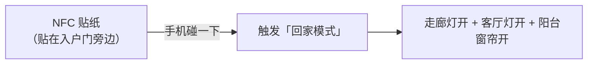

# 05 - 场景配置

## 第一步：整理房间分组

米家 App → 首页 → 右上角「编辑」→ 管理房间

建议分组：

| 房间   | 设备                        |
|--------|-----------------------------|
| 客厅   | 客厅三键开关                  |
| 餐厅   | 餐厅单键开关                  |
| 主卧   | 主卧双键开关、主卧窗帘电机     |
| 卧室A  | 卧室A双键开关                 |
| 卧室B  | 卧室B双键开关                 |
| 厨房   | 厨房单键开关                  |
| 公卫   | 公卫双键开关                  |
| 主卫   | 主卫单键开关                  |
| 走廊   | 走廊单键开关                  |
| 阳台   | 阳台单键开关、阳台窗帘电机     |

## 第二步：给按键命名

::: warning 这一步非常重要！命名后语音控制才精准
:::

| 开关     | 键位 | 命名             | 备注                           |
|----------|------|------------------|--------------------------------|
| 客厅开关 | 键1  | 「客厅主灯」      |                                |
| 客厅开关 | 键2  | 「客厅射灯」      |                                |
| 客厅开关 | 键3  | 「客厅灯带」      |                                |
| 主卧开关 | 键1  | 「主卧灯」        |                                |
| 主卧开关 | 键2  | 「主卧氛围灯」    |                                |
| 卧室A开关 | 键1 | 「卧室A灯」       | 或用孩子名/功能命名，如「书房灯」 |
| 卧室A开关 | 键2 | 「卧室A辅灯」     |                                |
| 卧室B开关 | 键1 | 「卧室B灯」       |                                |
| 卧室B开关 | 键2 | 「卧室B辅灯」     |                                |
| 公卫开关 | 键1  | 「公卫顶灯」      |                                |
| 公卫开关 | 键2  | 「公卫镜前灯」    |                                |
| 主卫开关 | 键1  | 「主卫灯」        |                                |
| 窗帘     | —   | 「阳台窗帘」「主卧窗帘」 |                           |

设置路径：米家 App → 设备 → 右上角「...」→ 设备名称/按键名称

## 第三步：创建智能场景

### 场景一览

| 场景     | 触发方式            | 执行动作                                     |
|----------|--------------------|--------------------------------------------|
| 回家模式 | 手动 / NFC          | 走廊灯开 + 客厅灯开 + 阳台窗帘开               |
| 离家模式 | 手动                | 全屋灯关 + 全部窗帘关                          |
| 晚安模式 | 语音 / 主卧长按键1   | 全屋灯关 + 主卧窗帘关 + 主卧氛围灯开            |
| 起床模式 | 定时 / 主卧双击键1   | 主卧窗帘开 + 阳台窗帘开 + 走廊灯开              |
| 夜起模式 | 主卧双击键2          | 走廊灯开 + 主卫灯开（延时5分钟后自动关）          |
| 会客模式 | 语音                | 客厅主灯开 + 射灯开 + 灯带开 + 餐厅灯开          |
| 观影模式 | 语音                | 客厅主灯关 + 灯带开 + 阳台窗帘关                 |
| 全关     | 语音                | 所有灯关闭 + 所有窗帘关闭                        |

---

### 场景详细配置

#### 1. 晚安模式（改进版）

**触发方式（任选其一）：**
- A. 语音触发 → 「小爱同学，晚安」
- B. 开关触发 → 主卧开关 键1 长按
- C. 定时触发 → 每天 23:00

**执行动作：**
1. **关闭所有灯**：客厅主灯/射灯/灯带 → 关，餐厅灯 → 关，走廊灯 → 关，厨房灯 → 关，公卫顶灯/镜前灯 → 关，主卫灯 → 关，卧室A灯/辅灯 → 关，卧室B灯/辅灯 → 关，主卧灯 → 关
2. **窗帘联动**：主卧窗帘 → 关闭
3. **氛围灯保留（可选）**：主卧氛围灯 → 开启（如果不需要，删除这条即可）

::: tip 与旧版区别
- 增加了「主卧开关长按」触发 → 躺床上不用喊小爱
- 保留主卧氛围灯 → 不是一下全黑，给你几分钟缓冲
- 氛围灯可以再做一个 5 分钟延时关闭的自动化
:::

**氛围灯延时关闭（可选附加自动化）：**

米家 App → 智能 → 新建自动化

- **触发条件**：主卧氛围灯 → 开启
- **执行动作**：延时 5 分钟 → 主卧氛围灯 → 关闭

::: warning
这条自动化会在任何时候氛围灯开启后 5 分钟关灯。如果你平时也会单独用氛围灯，建议改为：生效时间段设为 22:00 - 06:00（只在夜间生效）
:::

#### 2. 起床模式（改进版）

**触发方式（任选其一）：**
- A. 定时触发 → 工作日 7:30 / 周末 9:00
- B. 开关触发 → 主卧开关 键1 双击

**执行动作：**
1. **窗帘打开**：主卧窗帘 → 打开，阳台窗帘 → 打开
2. **走廊灯开**（阴天/冬天早起有用）：走廊灯 → 开启

::: tip 与旧版区别
- 增加了「主卧开关双击」触发 → 醒了顺手双击就行
- 增加走廊灯 → 起床后走出卧室不摸黑
- 定时分工作日/周末两套（各建一个自动化）
:::

::: details 定时分两套
**自动化 1：「工作日起床」**
- 触发：定时 07:30，重复＝周一到周五
- 动作：主卧窗帘开 + 阳台窗帘开 + 走廊灯开

**自动化 2：「周末起床」**
- 触发：定时 09:00，重复＝周六、周日
- 动作：主卧窗帘开 + 阳台窗帘开（周末不开走廊灯，让自然光叫醒你）
:::

#### 3. 夜起模式（新增）

**场景说明**：半夜起来上厕所，不想开大灯刺眼，也不想摸黑走路

**触发方式**：主卧开关 键2 双击

**执行动作：**
1. 走廊灯 → 开启
2. 主卫灯 → 开启
3. （自动关闭）延时 5 分钟 → 走廊灯关闭 + 主卫灯关闭

::: warning 配置要点
- 需要两条配置：一条手动场景 + 一条自动化
- 手动场景：双击触发 → 开走廊灯 + 开主卫灯
- 自动化：走廊灯开启 → 延时 5 分钟 → 关走廊灯 + 关主卫灯
- 自动化的「生效时间」设为 22:00 - 06:00（避免白天误触）
:::

::: details 米家 App 配置步骤
**第一条：手动场景**
- 智能 → + → 手动执行 → 添加动作：走廊灯 开 + 主卫灯 开 → 命名「夜起模式」→ 保存

**第二条：开关绑定**
- 主卧双键开关 → 键2 → 双击 → 执行「夜起模式」

**第三条：自动关灯**
- 智能 → + → 自动化 → 触发条件：走廊灯 → 开启 → 生效时间：22:00 - 06:00 → 执行动作：延时 5 分钟 → 走廊灯 关 + 主卫灯 关 → 命名「夜间自动关灯」→ 保存
:::

#### 4. 会客模式（新增）

**场景说明**：朋友来家里做客，客厅+餐厅全开，营造明亮氛围

**触发方式**：语音触发 → 「小爱同学，来客人了」

**执行动作**：客厅主灯 → 开启，客厅射灯 → 开启，客厅灯带 → 开启，餐厅灯 → 开启，走廊灯 → 开启，阳台窗帘 → 打开

米家 App 配置：智能 → + → 手动执行 → 添加以上动作 → 命名「会客模式」

#### 5. 观影模式

**触发方式**：语音触发 → 「小爱同学，我要看电影」

**执行动作：**
- 客厅主灯 → 关闭
- 客厅射灯 → 关闭
- 客厅灯带 → 开启 ← 保留氛围光
- 阳台窗帘 → 关闭 ← 遮光
- 餐厅灯 → 关闭

#### 6. 回家 / 离家 / 全关

| 场景     | 触发                         | 动作                                |
|----------|------------------------------|-------------------------------------|
| 回家模式 | 手动 / NFC                    | 走廊灯开 + 客厅主灯开 + 阳台窗帘开   |
| 离家模式 | 手动                          | 全屋灯关 + 全部窗帘关               |
| 全关     | 语音「小爱同学，关闭所有灯」     | 所有灯关闭 + 所有窗帘关闭            |

---

## 第四步：双控联动（T1 开关核心玩法）

::: tip 领普 T1 开关每个按键支持三种动作

| 操作 | 功能                               |
|------|-----------------------------------|
| 单击 | 正常开关灯（默认功能，不需要额外配置） |
| 双击 | 绑定场景 / 控制其他房间设备           |
| 长按 | 绑定场景 / 控制其他房间设备           |

设置路径：米家 App → 设备（开关）→ 按键设置 → 双击/长按 → 绑定场景
:::

### 推荐双控方案

| 开关位置   | 动作 | 绑定功能                         |
|-----------|------|----------------------------------|
| 主卧 键1  | 单击 | 正常开关主卧灯（默认）              |
| 主卧 键1  | 双击 | → 执行「起床模式」                 |
| 主卧 键1  | 长按 | → 执行「晚安模式」                 |
| 主卧 键2  | 单击 | 正常开关主卧氛围灯（默认）           |
| 主卧 键2  | 双击 | → 执行「夜起模式」                 |
| 主卧 键2  | 长按 | → 关闭全屋灯                      |
| 客厅 键1  | 单击 | 正常开关客厅主灯（默认）             |
| 客厅 键1  | 双击 | → 执行「会客模式」（全开）           |
| 客厅 键1  | 长按 | → 执行「观影模式」                  |
| 客厅 键2  | 单击 | 正常开关客厅射灯（默认）             |
| 客厅 键2  | 双击 | → 打开/关闭阳台窗帘                |
| 客厅 键2  | 长按 | → 执行「离家模式」                  |
| 走廊 键1  | 单击 | 正常开关走廊灯（默认）               |
| 走廊 键1  | 双击 | → 执行「回家模式」                  |
| 走廊 键1  | 长按 | → 执行「全关」                     |

### 配置步骤（以主卧 键1 长按 = 晚安模式为例）

1. 先确保已创建「晚安模式」手动场景（参考上面的详细配置）
2. 打开米家 App → 主卧双键开关 → 右上角「...」→ 按键设置 → 键 1 → 长按 → 执行智能场景 → 选择「晚安模式」→ 保存
3. 测试：长按主卧开关键1，全屋灯应该全部关闭

::: info 注意事项
- 单击仍然是正常开关灯，不影响日常使用
- 双击/长按是「额外」的快捷操作
- 家里老人/小孩只需要知道「按一下开关灯」就行
- 双击/长按属于进阶玩法，不配置也完全不影响
:::

---

## 第五步：语音控制

### 常用语音指令

**单个设备控制：**
- 「小爱同学，打开客厅主灯」
- 「小爱同学，关闭主卧灯」
- 「小爱同学，打开阳台窗帘」
- 「小爱同学，阳台窗帘开到一半」← 支持百分比

**房间级控制：**
- 「小爱同学，打开客厅的灯」← 客厅所有灯
- 「小爱同学，关掉卧室的灯」

**全屋控制：**
- 「小爱同学，关闭所有灯」

**场景控制：**
- 「小爱同学，晚安」← 自动匹配晚安模式
- 「小爱同学，执行回家模式」
- 「小爱同学，我要看电影」← 匹配观影模式
- 「小爱同学，来客人了」← 匹配会客模式

### NFC 贴纸（可选进阶）

成本：NFC 贴纸约 1 元/个

设置：米家 App → 智能 → 新建场景 → NFC 触发。把 NFC 贴纸贴在你每天进门会经过的位置。

---

## 场景配置速查表

**必配（日常使用）：**
- ★★★ 晚安模式 → 一键全关 + 关窗帘
- ★★★ 起床模式 → 定时开窗帘
- ★★★ 回家/离家 → 一键切换状态

**推荐配（提升体验）：**
- ★★☆ 夜起模式 → 半夜上厕所不摸黑
- ★★☆ 主卧双控 → 躺床上就能控制全屋
- ★★☆ 观影模式 → 看电影氛围感

**可选配（锦上添花）：**
- ★☆☆ 会客模式 → 来客人一键全开
- ★☆☆ 客厅双控 → 沙发上控制窗帘/场景
- ★☆☆ NFC 贴纸 → 进门刷手机触发
