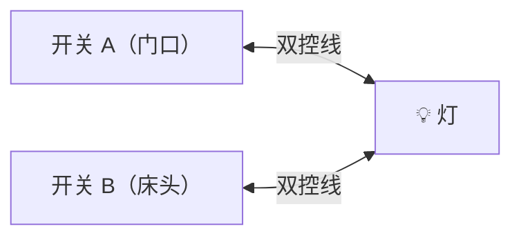
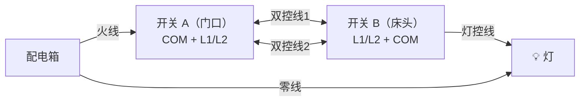
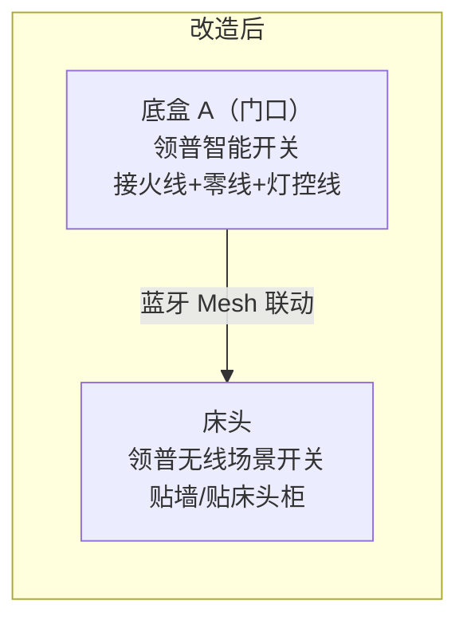
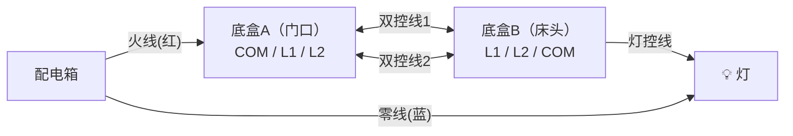
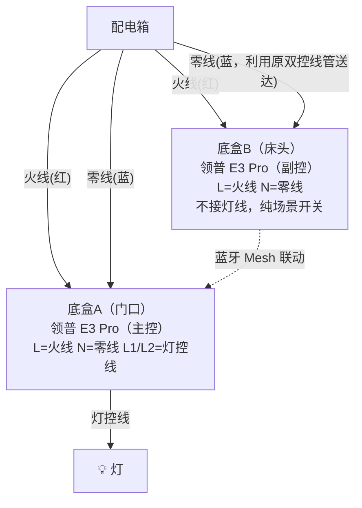

# 07 - 开关类型详解：单控、双控、多控的处理方式

## 什么是单控和双控？

**【单控】一个开关控制一个灯**

只有一个位置能开关这个灯

**【双控】两个开关控制同一个灯（最常见场景：卧室门口 + 床头）**

任意一个位置都能开/关灯

## 传统双控的接线方式（你家现在的状态）

- 底盒 A 内有：火线 + 两根双控线（到 B 的）
- 底盒 B 内有：灯控线 + 两根双控线（从 A 来的）

::: warning
传统双控底盒 B 里通常**没有火线**也**没有零线**！
:::

---

## 智能开关处理双控的三种方案

### 方案一：两边都装有线智能开关（推荐，体验最好）

::: tip 方案一概要
- **前提**：两个底盒都有火线和零线（新装修必须让电工预留！）
- **成本**：两个领普 E3 Pro ~100-160元（看键数）
- **难度**：★★☆☆☆
- **推荐度**：⭐⭐⭐⭐⭐
:::

新装修全屋智能开关的最优解：两边都装有线 E3 Pro，手感一致、AG 玻璃面板、体验远好于无线贴片。

**核心思路：只留一个主控接灯，副位只接火线零线当场景开关**

**接线改造：**
- **主控位（门口）**：接 L（火线）、N（零线）、L1/L2（灯控线）— 实际控制灯具通断
- **副控位（床头）**：只接 L（火线）、N（零线）供电 — 不接灯线，按键通过米家联动控制主控
- 原来双控的两根 L1/L2 控制线，一根改接零线送到副位底盒，一根废弃（电工胶带包好）

::: tip 副控联动配置（米家 App）
米家 App → 智能 → 新建自动化

- **触发条件**：副位开关（床头）→ 键1 单击
- **执行动作**：主位开关（门口）→ 键1 切换状态

按床头开关 = 按门口开关，局域网内延迟 < 100ms，体感无差别
:::

::: info 副位多余的键 = 场景按钮
副位选四键，2 键绑灯控联动，剩下 2 键绑场景：
- 键3 单击 → 睡眠模式（全屋关灯+关窗帘）
- 键4 单击 → 起床模式（开窗帘+开主灯）
- 键3 长按 → 全屋关灯
:::

### 方案二：主开关 + 无线开关（副位没零线的备选）

::: info 方案二概要
- **适用场景**：老房改造，副位底盒没有火线和零线
- **成本**：领普有线开关 ~50元 + 领普无线开关 ~30元 = 80元
- **难度**：★☆☆☆☆（最简单）
- **推荐度**：⭐⭐⭐（副位没零线时才考虑）
:::

::: details 底盒 A 接线方式
- 把原来的双控线弃用（用电工胶带包好塞回底盒）
- 从底盒 A 经过双控线管穿一根灯控线到灯具（或者让电工把 B 盒的灯控线改接到 A 盒）
- 最终 A 盒内：**L** ← 火线，**N** ← 零线，**L1** ← 灯控线（到灯具）
:::

**底盒 B 处理：**
- 方式1：保留底盒，装一个空白面板遮住
- 方式2：在 B 的位置贴一个领普无线场景开关，通过米家 App 设置联动 A 的智能开关

::: tip 无线开关配置联动（米家 App）
米家 App → 智能 → 新建自动化

- **触发条件**：领普无线开关 → 单击
- **执行动作**：主卧灯 → 切换开关状态

这样按无线开关 = 按有线开关，效果一模一样
:::

### 方案三：单火版开关（不推荐）

::: warning 方案三概要
- **适用场景**：B 盒确实没零线，又不想用无线开关
- **成本**：零线版 ~50 + 单火版 ~60 = 110元
- **难度**：★★☆☆☆
- **推荐度**：⭐⭐（单火版可能有灯闪问题，不如方案一/二省事）

新装修不需要考虑这个方案，让电工预留零线即可。
:::

---

## 你家哪里可能有双控？

你家常见的双控位置：

| 位置             | 双控情况           | 推荐方案                |
|------------------|--------------------|------------------------|
| 主卧(17.7㎡)     | 门口 ↔ 床头，双控 | ⭐ 方案一（两边都装有线 E3 Pro） |
| 卧室A(9.6㎡)     | 门口 ↔ 床头，看实际     | ⭐ 方案一，两边都装有线     |
| 卧室B(11.1㎡)    | 门口 ↔ 床头，看实际     | ⭐ 方案一，两边都装有线     |
| 走廊             | 走廊两头，看实际         | ⭐ 方案一（两边都装有线 E3 Pro） |
| 客厅             | 一般单控               | 不需要处理               |
| 餐厅             | 一般单控               | 不需要处理               |
| 厨房             | 一般单控               | 不需要处理               |
| 公卫/主卫         | 一般单控               | 不需要处理               |
| 阳台             | 一般单控               | 不需要处理               |

## 怎么判断你家是不是双控？

**Step 1：数底盒**

一个房间里如果有 2 个开关位置控制同一个灯 → 这就是双控。例：主卧门口有一个开关，床头也有一个开关，都能控制主卧的灯 → 双控

**Step 2：看底盒里的线**

打开底盒 B（通常是床头那个）：
- 如果有：火线 + 零线 + 灯控线 → 两边都能装有线
- 如果只有：2 根双控线 + 灯控线 → 没有零线 → 必须用方案一（有线+无线）

---

## 双控改造接线详解（方案一：两边都装有线）

以主卧为例：

**改造前（传统双控接线）：**

**改造后（两边都装有线 E3 Pro）：**

::: info 接线改造要点
- **底盒 A（主控）**：火线 + 零线 + 灯控线，实际控制灯具
- **底盒 B（副控）**：只接火线 + 零线供电，不接灯线
- 原来的两根双控线：一根改接零线（从 A 送到 B），一根废弃（电工胶带包好）
- 灯控线接到主控位（门口），如果原来从 B 出去到灯具，需要让电工改到从 A 走
:::

::: warning 关键操作
1. 让电工把灯控线接到底盒 A（主控位）
2. 利用原双控线管把零线送到底盒 B（副控位），确保两边都有火线+零线
3. 这个改造最好让电工处理，不要自己瞎接
:::

---

## 各位置开关类型速查表

| 位置        | 单控/双控 | 实际灯路 | 推荐购买键数 | 多出场景键 | 副位配件                       |
|------------|----------|---------|-------------|-----------|-------------------------------|
| 客厅        | 单控     | 3路     | **四键**有线 | +1        | 无                            |
| 餐厅        | 单控     | 1路     | **三键**有线 | +2        | 无                            |
| 主卧(门口)  | 双控主控 | 2路     | **四键**有线 | +2        | —                             |
| 主卧(床头)  | 双控副控 | 不接灯线 | **四键**有线 | +4（全部当场景键） | 副位 E3 Pro，只接火线零线 |
| 卧室A(门口) | 看实际   | 2路     | **四键**有线 | +2        | 如果双控 → + 床头副位四键有线   |
| 卧室B(门口) | 看实际   | 2路     | **四键**有线 | +2        | 如果双控 → + 床头副位四键有线   |
| 厨房        | 单控     | 1路     | **三键**有线 | +2        | 无                            |
| 公卫        | 单控     | 2路     | **四键**有线 | +2        | 无                            |
| 主卫        | 单控     | 1路     | **三键**有线 | +2        | 无                            |
| 走廊        | 看实际   | 1路     | **三键**有线 | +2        | 如果双控 → + 远端副位三键有线   |
| 阳台        | 单控     | 1路     | **三键**有线 | +2        | 无                            |

> **双控副位不接灯线**：副位开关只接火线+零线供电，所有按键都可以作为场景按钮。通过米家联动控制主位的灯，同时多余键绑定睡眠模式、全屋关灯等高频场景。
>
> 多键策略：多出来的键通过米家 App 绑定为场景按钮，后期转智能灯时开关变纯场景控制器，可玩性极高
