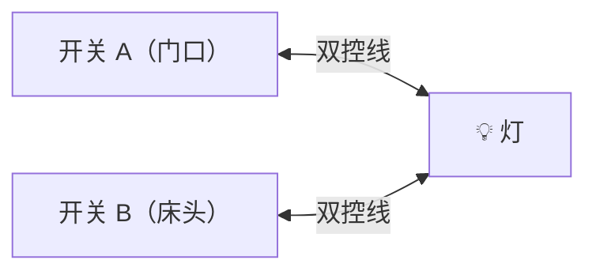
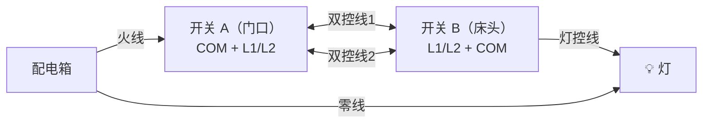
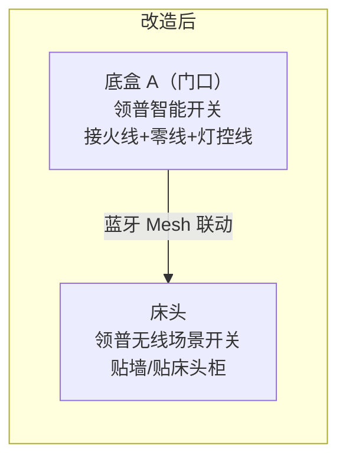
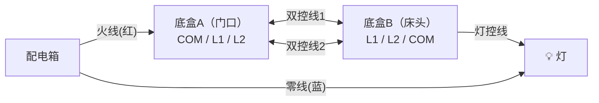
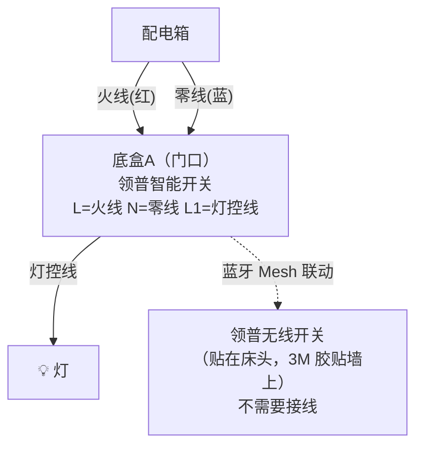

# 07 - 开关类型详解：单控、双控、多控的处理方式

## 什么是单控和双控？

**【单控】一个开关控制一个灯**

只有一个位置能开关这个灯

**【双控】两个开关控制同一个灯（最常见场景：卧室门口 + 床头）**

任意一个位置都能开/关灯

## 传统双控的接线方式（你家现在的状态）

- 底盒 A 内有：火线 + 两根双控线（到 B 的）
- 底盒 B 内有：灯控线 + 两根双控线（从 A 来的）

::: warning
传统双控底盒 B 里通常**没有火线**也**没有零线**！
:::

---

## 智能开关处理双控的三种方案

### 方案一：主开关 + 无线开关（推荐，最省事）

::: tip 方案一概要
- **成本**：领普有线开关 ~50元 + 领普无线开关 ~30元 = 80元
- **难度**：★☆☆☆☆（最简单）
- **推荐度**：⭐⭐⭐⭐⭐
:::

**改造前 vs 改造后：**

::: details 底盒 A 接线方式
- 把原来的双控线弃用（用电工胶带包好塞回底盒）
- 从底盒 A 经过双控线管穿一根灯控线到灯具（或者让电工把 B 盒的灯控线改接到 A 盒）
- 最终 A 盒内：**L** ← 火线，**N** ← 零线，**L1** ← 灯控线（到灯具）
:::

**底盒 B 处理：**
- 方式1：保留底盒，装一个空白面板遮住
- 方式2：在 B 的位置贴一个领普无线场景开关，通过米家 App 设置联动 A 的智能开关

::: tip 无线开关配置联动（米家 App）
米家 App → 智能 → 新建自动化

- **触发条件**：领普无线开关 → 单击
- **执行动作**：主卧灯 → 切换开关状态

这样按无线开关 = 按有线开关，效果一模一样
:::

### 方案二：两个位置都装智能开关（适合两边都有零线）

::: info 方案二概要
- **前提**：两个底盒都有火线和零线（大部分双控 B 盒没有！）
- **成本**：两个领普开关 ~100元
- **难度**：★★★☆☆
- **推荐度**：⭐⭐⭐（仅限两边都有零线的情况）
:::

只有当底盒 B 也预留了火线和零线时才能用这个方案！

::: warning
两个开关分别接灯控线，在 App 里设置联动。实际上只有一个真正接灯（另一个通过米家联动控制那个），或者两个都接灯（需要电工确认线路）。
:::

### 方案三：单火版开关（不推荐，但作为备选）

::: warning 方案三概要
- **适用场景**：B 盒确实没零线，又不想用无线开关
- **成本**：零线版 ~50 + 单火版 ~60 = 110元
- **难度**：★★☆☆☆
- **推荐度**：⭐⭐（单火版可能有灯闪问题，不如方案一省事）

不推荐。方案一（有线+无线）是最优解。
:::

---

## 你家哪里可能有双控？

你家常见的双控位置：

| 位置             | 双控情况           | 推荐方案                |
|------------------|--------------------|------------------------|
| 主卧(17.7㎡)     | 门口 ↔ 床头，很可能有双控 | ⭐ 方案一（有线+无线开关） |
| 卧室A(9.6㎡)     | 门口 ↔ 床头，不一定有     | ⭐ 方案一，看实际线路     |
| 卧室B(11.1㎡)    | 门口 ↔ 床头，不一定有     | ⭐ 方案一，看实际线路     |
| 走廊             | 走廊两头，看实际         | ⭐ 方案一（有线+无线开关） |
| 客厅             | 一般单控               | 不需要处理               |
| 餐厅             | 一般单控               | 不需要处理               |
| 厨房             | 一般单控               | 不需要处理               |
| 公卫/主卫         | 一般单控               | 不需要处理               |
| 阳台             | 一般单控               | 不需要处理               |

## 怎么判断你家是不是双控？

**Step 1：数底盒**

一个房间里如果有 2 个开关位置控制同一个灯 → 这就是双控。例：主卧门口有一个开关，床头也有一个开关，都能控制主卧的灯 → 双控

**Step 2：看底盒里的线**

打开底盒 B（通常是床头那个）：
- 如果有：火线 + 零线 + 灯控线 → 两边都能装有线
- 如果只有：2 根双控线 + 灯控线 → 没有零线 → 必须用方案一（有线+无线）

---

## 双控改造接线详解（方案一）

以主卧为例：

**改造前（传统双控接线）：**

**改造后（方案一）：**

::: info 底盒 B 处理
- 原双控线用电工胶带包好塞回底盒，装空白面板盖住
- 或者让电工把灯控线从 B 拉回 A
:::

::: warning 关键操作
让电工把灯控线接到底盒 A 这边。如果灯控线原本从 B 出去到灯具，需要把线改到从 A 走。这个最好让电工处理，不要自己瞎接。
:::

---

## 各位置开关类型速查表

| 位置        | 单控/双控 | 推荐开关   | 额外配件                       |
|------------|----------|-----------|-------------------------------|
| 客厅        | 单控     | 三键有线   | 无                            |
| 餐厅        | 单控     | 单键有线   | 无                            |
| 主卧(门口)  | 双控     | 双键有线   | + 无线开关（贴床头）           |
| 主卧(床头)  | 双控     | —         | 用无线开关替代                 |
| 卧室A(门口) | 看实际   | 双键有线   | 如果双控 → + 无线开关          |
| 卧室B(门口) | 看实际   | 双键有线   | 如果双控 → + 无线开关          |
| 厨房        | 单控     | 单键有线   | 无                            |
| 公卫        | 单控     | 双键有线   | 无                            |
| 主卫        | 单控     | 单键有线   | 无                            |
| 走廊        | 看实际   | 单键有线   | 如果双控 → + 无线开关          |
| 阳台        | 单控     | 单键有线   | 无                            |

如果你家 3 个卧室都有双控 + 走廊双控：额外需要 4 个无线开关 x 30 元 = 120 元，总预算从 1560 → 1680 元
