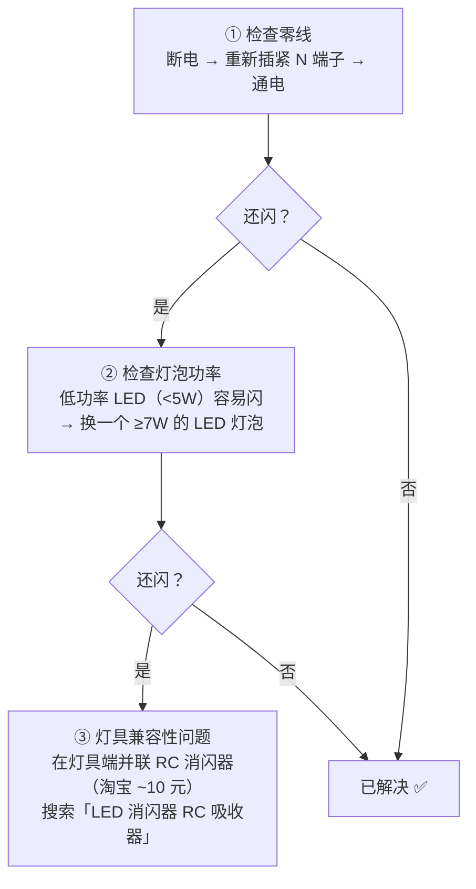
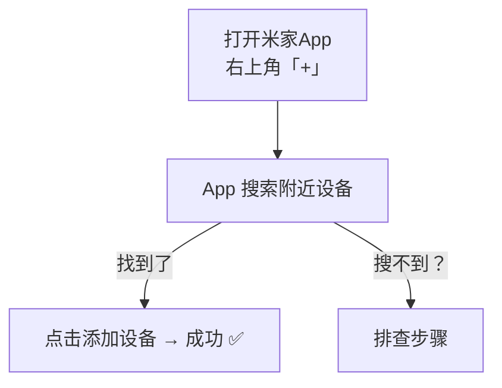

# 08 - 调试与验收指南

## 调试总流程

安装完一个开关后，按以下流程逐项验证：

---

## 第一步：物理按键测试

通电后，先不管配对，测试开关的物理功能：

| 测试项     | 预期结果     | 异常处理                      |
|-----------|-------------|------------------------------|
| 按键1 按下 | 灯1 亮      | 不亮→检查 L1 接线             |
| 按键1 再按 | 灯1 灭      | 不灭→L1 可能短路到火线        |
| 按键2 按下 | 灯2 亮      | 不亮→检查 L2 接线             |
| 按键2 再按 | 灯2 灭      |                              |
| 按键3 按下 | 灯3 亮      | 不亮→检查 L3 接线             |
| 按键3 再按 | 灯3 灭      |                              |
| 指示灯     | 常亮(待机)   | 不亮→检查 L 和 N 是否接反     |
| 按键手感   | 清脆有回馈   | 松动→螺丝没拧紧              |

### 常见物理问题排查

**问题：按键1 控制的是灯2，按键2 控制的是灯1（接反了）**

原因：L1 和 L2 的灯控线接反了

解决：1. 断电 → 2. 把 L1 和 L2 的线对调 → 3. 通电重试。或者不拆线，在 App 里把按键1和按键2的名字互换（偷懒方案，但有效）。

**问题：灯泡闪烁**

**问题：通电后开关指示灯不亮、灯也不亮**

::: details 可能原因
1. 空开没合上 → 去配电箱检查
2. 火线(L)和零线(N)都没接 → 断电重新接线
3. 火线(L)和零线(N)接反了 → 电笔测：有电的是火线接 L，没电的是零线接 N
4. 开关坏了（极少见）→ 换一个试试
:::

---

## 第二步：蓝牙配对测试

::: details 配对搜不到？排查步骤
1. **手机蓝牙是否开启？** → 设置 → 蓝牙 → 打开
2. **距离是否够近？** → 走到开关旁边 1 米内
3. **开关是否进入配对模式？** → 长按任意按键 10 秒，指示灯快速闪烁 = 配对模式
4. **是否被其他账号绑定了？** → 长按任意按键 15 秒 → 恢复出厂设置，指示灯闪3下 = 已重置，重新搜索配对
5. **米家 App 是否最新版？** → 应用商店更新到最新
6. **手机系统是否给了米家蓝牙权限？** → 手机设置 → 应用 → 米家 → 权限 → 蓝牙 ✅
:::

---

## 第三步：App 远程控制测试

测试方法：手机关掉 Wi-Fi 和蓝牙，切换到 4G/5G 移动网络

| 测试项          | 预期            | 异常处理              |
|----------------|----------------|----------------------|
| App 点击开灯    | 灯亮，延迟 <2秒 | 检查音箱是否在线       |
| App 点击关灯    | 灯灭            | 检查 Wi-Fi 连接       |
| 查看设备状态    | 显示「在线」     | 音箱离线则设备也离线   |
| 窗帘滑条拖到 50% | 窗帘开到一半   | 重新校准行程           |

---

## 第四步：语音控制测试

语音测试清单（对着小爱音箱说）：

| 语音指令              | 预期         | 如果不行     |
|----------------------|-------------|-------------|
| 「打开客厅主灯」       | 客厅主灯亮   | 检查按键命名 |
| 「关闭客厅主灯」       | 客厅主灯灭   |             |
| 「打开客厅的灯」       | 客厅所有灯亮 | 检查房间分组 |
| 「关闭所有灯」         | 全屋灯灭     |             |
| 「打开主卧窗帘」       | 窗帘打开     | 检查设备命名 |
| 「主卧窗帘开到一半」    | 窗帘开50%   |             |
| 「晚安」              | 执行晚安场景 | 检查场景名称 |

::: warning 语音控制不准确？最常见原因：设备命名不对
- ✗ 差的命名：「开关1-按键1」→ 小爱听不懂
- ✓ 好的命名：「客厅主灯」「主卧灯」「餐厅灯」→ 小爱一听就懂

修改命名：米家App → 设备 → 右上角「...」→ 按键设置 → 名称
:::

---

## 第五步：场景联动测试

逐个测试每个场景：

| 场景     | 测试方法与预期                                             |
|----------|----------------------------------------------------------|
| 回家模式 | 手动触发 → 走廊灯+客厅灯亮 + 阳台窗帘开                    |
| 离家模式 | 手动触发 → 全屋灯灭 + 窗帘关                               |
| 晚安模式 | 说「小爱晚安」→ 全灯灭 + 主卧窗帘关                        |
| 起床模式 | 等定时触发（或改1分钟后测试）→ 主卧+阳台窗帘开               |
| 观影模式 | 说「我要看电影」→ 主灯灭+射灯开+阳台窗帘关                  |
| 双控联动 | 按无线开关 → 对应灯正确开/关；两边状态同步（A开灯，B也知道灯是开的） |

::: warning 场景执行不完整？（部分设备没反应）
1. 确认场景里是否漏加了某个设备
2. 确认设备在线（App 里不是灰色）
3. 设备离网关太远 → 信号问题 → 中间的开关作为 Mesh 中继是否在线？
:::

---

## 全屋验收 Checklist

逐房间验收（每个房间都过一遍）：

**客厅**
- [ ] 主灯：物理按键 | App控制 | 语音控制
- [ ] 射灯：物理按键 | App控制 | 语音控制
- [ ] 灯带：物理按键 | App控制 | 语音控制

**餐厅**
- [ ] 餐厅灯：物理按键 | App控制 | 语音控制

**主卧（17.7㎡）**
- [ ] 主灯：物理按键 | App控制 | 语音控制
- [ ] 氛围灯：物理按键 | App控制 | 语音控制
- [ ] 床头无线开关：按键联动正常
- [ ] 窗帘：App控制 | 语音控制 | 行程准确

**卧室A（9.6㎡）**
- [ ] 主灯：物理按键 | App控制 | 语音控制
- [ ] 辅灯：物理按键 | App控制 | 语音控制
- [ ] (如有双控) 无线开关联动

**卧室B（11.1㎡）**
- [ ] 主灯：物理按键 | App控制 | 语音控制
- [ ] 辅灯：物理按键 | App控制 | 语音控制
- [ ] (如有双控) 无线开关联动

**阳台**
- [ ] 阳台灯：物理按键 | App控制 | 语音控制
- [ ] 窗帘：App控制 | 语音控制 | 行程准确

**厨房 / 公卫 / 主卫 / 走廊**
- [ ] 各路灯：物理按键 | App控制 | 语音控制

**全局测试**
- [ ] 远程控制（4G 网络下 App 控制正常）
- [ ] 回家场景
- [ ] 离家场景
- [ ] 晚安场景
- [ ] 起床场景
- [ ] 「关闭所有灯」语音指令
