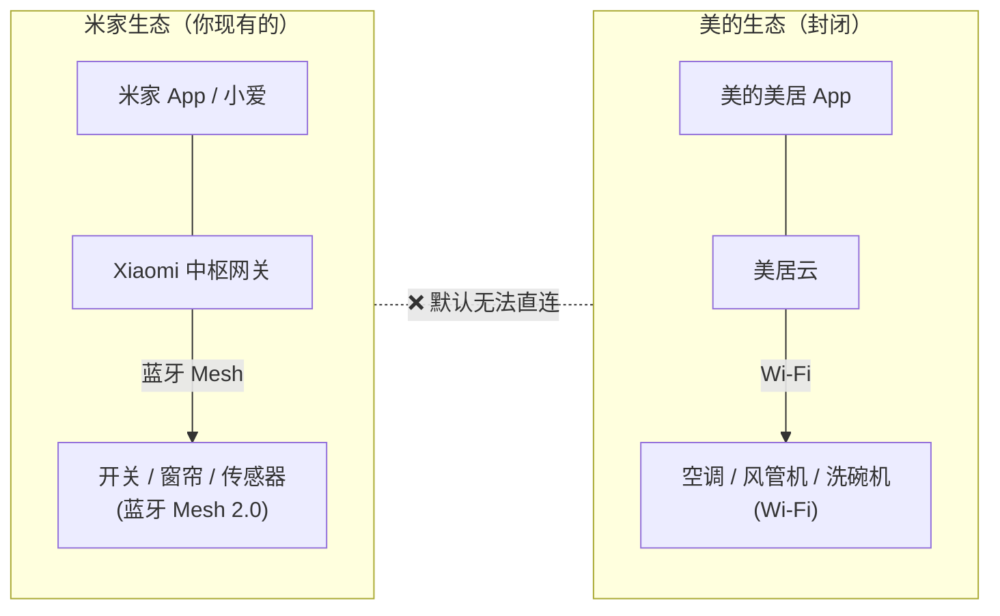
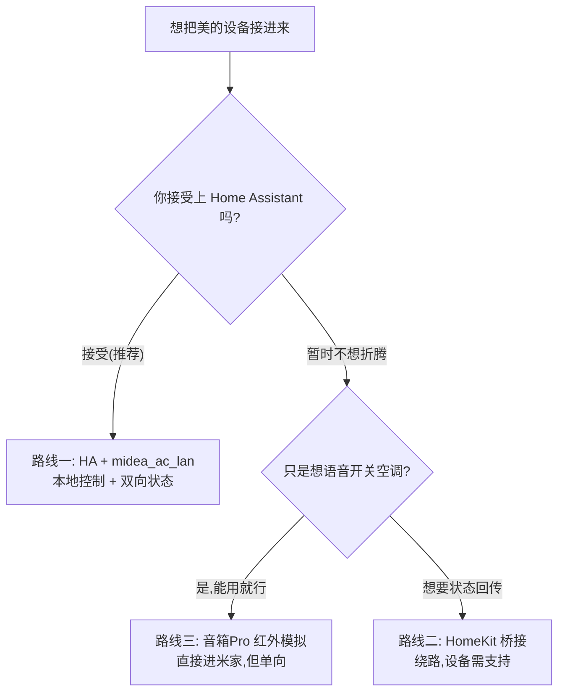
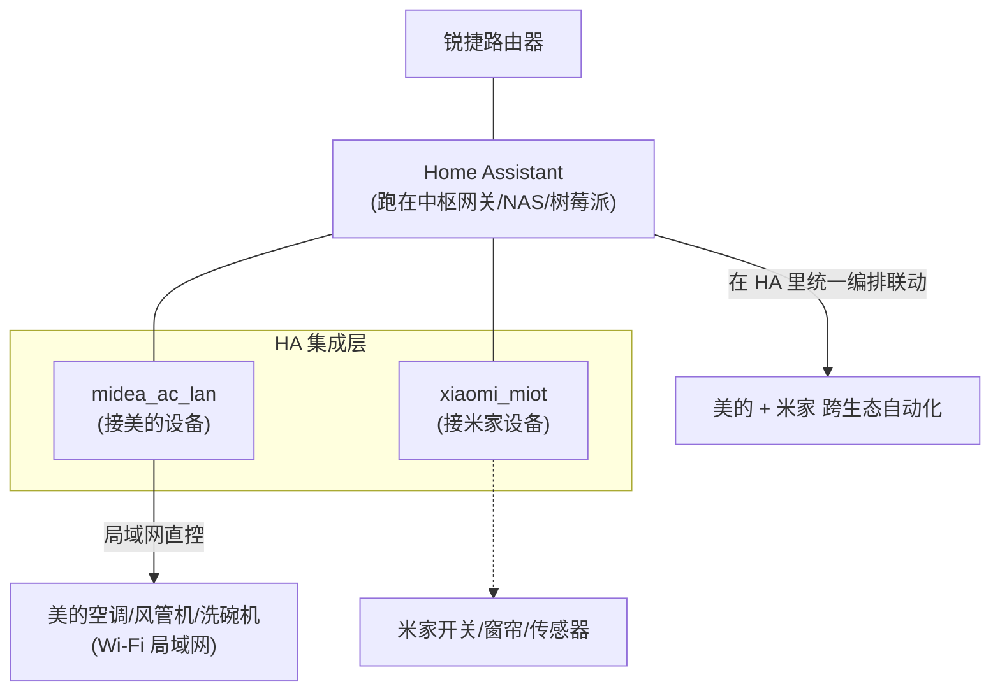
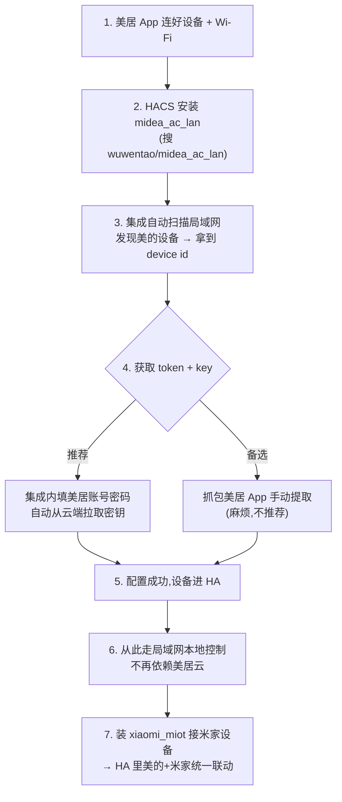
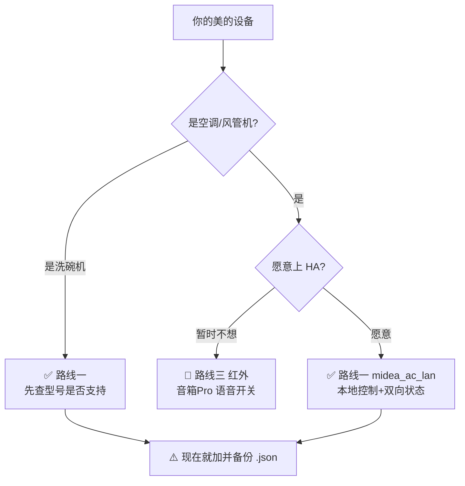

# 09 - 美的美居接入米家（空调 / 风管机 / 洗碗机）

::: tip 本篇解决什么问题
你家的灯光、窗帘、开关走的是**米家 + 蓝牙 Mesh 2.0**，但美的的空调、风管机、洗碗机走的是**美的美居 App + Wi-Fi 云**，两个生态互相封闭。

这篇教你怎么把美的白电也拉进你的统一控制体系，实现「米家设备 + 美的设备一起联动」。
:::

## 一、先认清现实：两个生态是封闭的

::: warning 关键认知
- 美的设备**官方只接入美的美居**，米家**没有官方通道**直接发现美的设备。
- 美的设备走 **Wi-Fi + 美居云**，**进不了你的蓝牙 Mesh 网络**。
- 所以「原生直连」行不通，必须通过**桥接**。
:::

## 二、三条路线对比

| 路线 | 核心工具 | 本地控制 | 状态回传 | 难度 | 适合谁 |
|------|---------|---------|---------|------|--------|
| 🥇 **HA + midea_ac_lan** | Home Assistant | ✅ 局域网 | ✅ 双向 | 中 | 想要完整体验、能折腾 |
| 🥈 **HomeKit 桥接** | HA homekit 集成 | 视设备 | ✅ | 中高 | 路线一受阻时 |
| 🥉 **音箱 Pro 红外** | Xiaomi 音箱 Pro | ❌ | ❌ 单向 | 低 | 只想语音开关空调 |

::: tip 结合你的方案
你已经规划了**中枢网关 + 后期上 HA**，且明确要「本地控制优先」。所以 **路线一是为你量身定做的**。红外（路线三）当保底——你清单里的音箱 Pro 本来就带红外。
:::

---

## 三、路线一：Home Assistant + midea_ac_lan（推荐）

这是社区最成熟的方案。`midea_ac_lan` 支持空调、风管机、洗碗机、洗衣机、热水器等几乎全线美的白电。

### 各设备支持情况

| 设备 | 协议类型 | 本地控制 | 状态回传 | 备注 |
|------|---------|---------|---------|------|
| **美的空调** | `0xAC` | ✅ 完美 | ✅ | 支持温度/模式/风速/sleep/eco/turbo 等 |
| **美的风管机** | `0xAC`（同空调） | ✅ | ✅ | 本质是管道式空调，按空调识别 |
| **美的洗碗机** | `0xE1`（普通）/ `0x34`（水槽） | ⚠️ 部分型号 | ⚠️ | 需查 `doc/E1.md` 确认你的型号 |

### 整体接入架构

### 接入步骤（以空调 / 风管机为例）

::: info 前提
1. 美的设备先用**美居 App** 正常连上家里 Wi-Fi（确保 App 里能控制）。
2. 已经装好 Home Assistant（2024.4.1 或更高版本）。
3. 装好 HACS（Home Assistant 社区商店）。
:::

::: tip 关于 token / key（V3 设备必须）
较新的美的设备是 **V3 协议**，发现设备后需要 **token + key** 才能本地控制。

- **最省事**：在集成配置界面直接填**美的美居账号密码**，自动从云端拉取密钥。
- 密钥拿到并配置成功后，**可以删掉账号配置**，不影响设备本地使用。
- 老的 V2 设备只需要 IP + device id，不需要 token/key。
:::

### 推荐用哪个仓库

| 仓库 | 状态 | 说明 |
|------|------|------|
| **wuwentao/midea_ac_lan** | ✅ 当前活跃维护 | 推荐用这个，原生中文文档 `README_hans.md` |
| georgezhao2010/midea_ac_lan | ⚠️ 逐步弃用 | 老仓库，迁移到 wuwentao 后设备不会丢失 |
| mill1000/midea-ac-py | 仅空调 | 只支持 `0xAC`/`0xCC` 空调类，不支持洗碗机 |

搜索关键词：`midea_ac_lan HACS` → 装 **wuwentao/midea_ac_lan**

---

## 四、⚠️ 2026 年重大变化：Token API 正在关闭

::: danger 必读：现在就备份，否则以后可能加不了新设备
出于安全原因，美的正在**逐步关停旧的云端 Token API**：

- 美居云、智能家居云的 Token API **已陆续关闭**。
- 集成已切换到 **NetHome Plus 云** 的 Token API 来添加新设备，但这些接口**预计也会被陆续关闭**。
- 一旦全部关闭 → **无法再新增设备**，最终 V1 局域网控制 API 也可能失效。

**应对措施（强烈建议）：**
1. **趁现在能用，尽快把设备加进 HA**。
2. 添加成功后，**备份设备的 `.json` 配置文件**到 HAOS 之外的地方（U盘/NAS/电脑）。
3. 注意：只有 **V3 设备**有 `.json` 配置文件；老的 V2 设备没有。

> 已经加好并备份的设备，即使 API 关闭也能继续本地用。坑的是**以后新买的美的设备可能加不进来**。
:::

---

## 五、路线二：HomeKit 桥接（备选）

如果路线一某台设备死活接不进，可以绕道 HomeKit：

- 部分美的新机**原生支持 HomeKit** → 米家近年支持部分 HomeKit 设备，可尝试互通。
- 或用 HA 的 `homekit` 集成，把已接入 HA 的美的设备**反向暴露**给支持 HomeKit 的米家网关。

::: warning 绕路较多
HomeKit 桥接链路长、配置繁琐，仅在路线一受阻时考虑。优先走路线一。
:::

---

## 六、路线三：红外模拟（空调保底方案）

你的清单里有 **Xiaomi 智能音箱 Pro（带红外）**。如果某台美的空调连 HA 都接不进：

### 配置方法

1. 米家 App → 添加设备 → 选 **音箱 Pro 的红外遥控** 功能
2. 添加「空调」→ 选品牌「美的」→ 按提示对码
3. 成功后空调进米家，**可语音控制**（开关 / 温度 / 模式）

| 优点 | 缺点 |
|------|------|
| ✅ 直接进米家，零折腾 | ❌ **单向控制**：看不到空调真实状态 |
| ✅ 语音可控 | ❌ 不知道开没开、当前几度 |
| ✅ 不依赖美居云 | ❌ 红外要对着空调，隔墙不行 |

::: tip 什么时候用红外
- 老空调没 Wi-Fi、或型号 HA 接不进
- 只想「躺床上喊一句关空调」，不在乎状态回传
- 风管机/洗碗机**不适用**红外（它们不是红外遥控的）
:::

---

## 七、接入后能做什么联动？

接进 HA 后，美的设备和你的米家设备就能跨生态联动了：

| 场景 | 触发 | 动作 |
|------|------|------|
| 回家自动开空调 | 米家门窗传感器「开门」 | HA → 美的空调制冷 26℃ |
| 离家自动关空调 | 米家「离家模式」场景 | HA → 关所有美的空调 + 风管机 |
| 温湿度联动 | 米家温湿度传感器 > 28℃ | HA → 风管机自动制冷 |
| 洗碗完成提醒 | 美的洗碗机「完成」 | HA → 小爱播报 / 客厅灯闪烁 |
| 睡眠模式 | 床头开关「睡眠」键 | HA → 空调 sleep 模式 + 全屋关灯 |

::: info 为什么要在 HA 里联动，而不是米家里
米家里只有米家设备，美居里只有美的设备。**只有 HA 同时握着两边**，才能做「米家触发 → 美的执行」这种跨生态自动化。这正是上 HA 的核心价值。
:::

---

## 八、决策建议

::: tip 给你的最终建议
1. **第一批先把空调/风管机用路线一接进 HA**——这俩是 `0xAC`，支持最稳。
2. **洗碗机先查型号**（`doc/E1.md`），支持就一起接，不支持就先用美居 App 单独控制。
3. **接入后立刻备份 `.json`**——2026 年 Token API 在关闭，晚了可能加不了。
4. 实在接不进的空调，**用音箱 Pro 红外保底**，至少能语音开关。

> 这套方案让你的「全屋轻智能」从「只管灯光窗帘」升级到「连空调白电一起统一调度」，且全部走本地控制，符合你的核心原则。
:::

---

## 参考来源

- [wuwentao/midea_ac_lan（当前活跃维护仓库）](https://github.com/wuwentao/midea_ac_lan)
- [georgezhao2010/midea_ac_lan（中文文档 README_hans）](https://github.com/georgezhao2010/midea_ac_lan/blob/master/README_hans.md)
- [Midea AC LAN 社区讨论帖（HA Community）](https://community.home-assistant.io/t/midea-ac-lan-auto-discover-and-configure-your-midea-appliances-via-lan/461037)
- [mill1000/midea-ac-py（仅空调）](https://github.com/mill1000/midea-ac-py)
- [SmartHomeScene: Integrating Midea Group AC in Home Assistant](https://smarthomescene.com/guides/how-to-integrate-midea-group-air-conditioners-in-home-assistant/)
