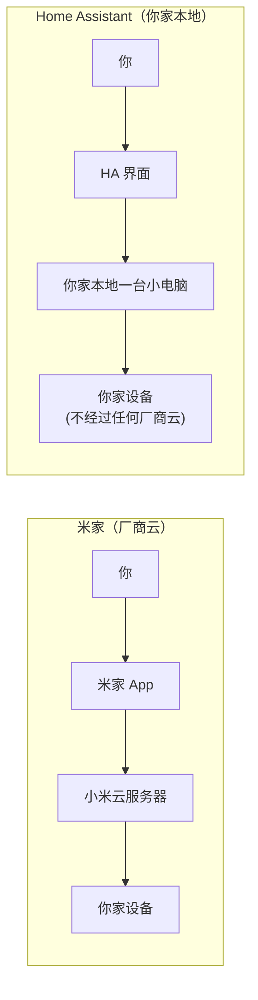
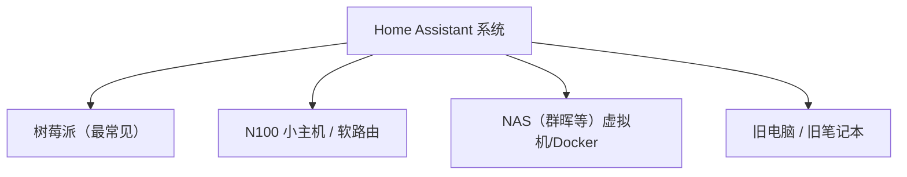
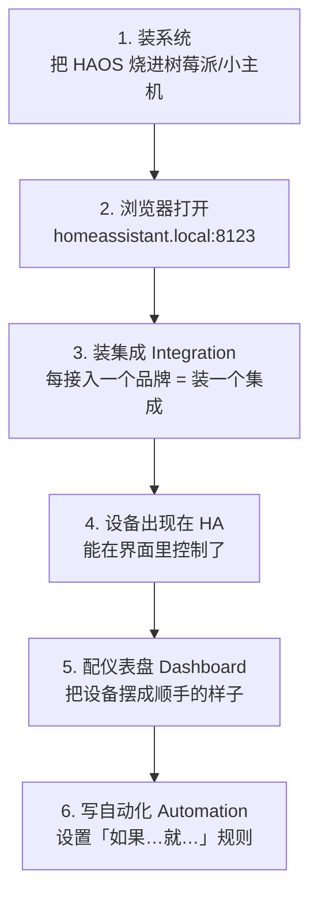
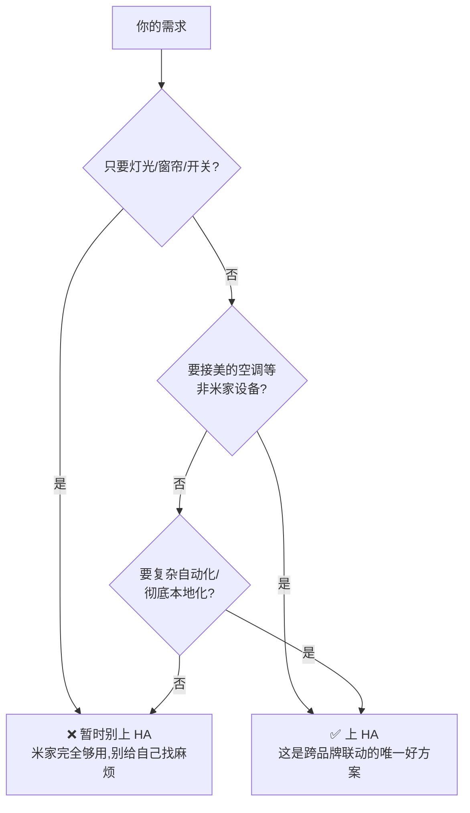

# 10 - Home Assistant 是什么、怎么用

::: tip 这篇先讲清楚「是什么」
要把美的空调/风管机/洗碗机接进来（见 [09-美的美居接入米家](./09-midea-to-mijia.md)），最佳路线是上 Home Assistant。但 HA 是个新东西，先把它讲明白——是什么、长什么样、怎么用、代价是什么，再谈买什么硬件、怎么接设备。
:::

## 一、Home Assistant 到底是什么？

一句话：**一个装在你家里的、开源免费的「全屋智能总控软件」**。

对比你现在的米家：



| | 米家 | Home Assistant |
|---|------|----------------|
| 谁的 | 小米的 | 中立、开源、免费 |
| 能接什么 | 只能米家生态 | **什么品牌都能接**（小米/美的/绿米/HomeKit…） |
| 跑在哪 | 小米云 | **你自己家里的设备**，不依赖厂商云 |

::: info 一个类比
- 米家 App = 苹果，只能装苹果商店的东西
- Home Assistant = 一台什么软件都能装的电脑
:::

::: warning HA 不是替代米家
HA 是**架在米家之上的「总指挥」**。你家的灯、开关、窗帘照样在米家里配、物理按键照样按。HA 的价值是：**把米家管不到的设备（美的空调）拉进来，做米家做不到的跨品牌联动**。
:::

## 二、HA 长什么样、怎么「用」？

HA 不是手机下个 App 就完事，它是一套**运行在硬件上的系统**。分三层理解：

### 1. 它跑在哪（载体）

HA 需要一台**一直开着的小机器**来跑（7×24 小时，就是你全屋智能的「大脑服务器」）：



> 具体选哪个、怎么部署，是下一篇的事。这篇只要知道「它需要一台常开的小机器」即可。

### 2. 你怎么操作它（界面）

装好后，它在你家局域网开一个网址，比如 `http://homeassistant.local:8123`：

- **电脑/手机浏览器**打开这个网址 → 就是控制台
- 也有官方**手机 App**（叫 Home Assistant）→ 手机上像用米家一样点

界面叫 **Dashboard（仪表盘）**，可以拖拽卡片，把灯、空调、窗帘、传感器都摆上去：

```
┌─────────────────────────────────┐
│  客厅   💡主灯  💡灯带  🪟窗帘    │
│  卧室   💡主灯  ❄️空调 26℃        │
│  传感器 🌡️26.5℃  💧55%           │
│  [回家模式] [离家] [晚安] [观影]  │
└─────────────────────────────────┘
```

### 3. 它帮你干什么（核心能力）

| 能力 | 说明 |
|------|------|
| **统一控制** | 所有品牌设备在一个界面里开关、调节 |
| **自动化** | 「如果…就…」：开门就开灯、超过 28℃ 就开空调、洗碗机洗完就语音提醒 |
| **跨品牌联动** | 米家传感器触发美的空调——这是米家自己做不到的 |
| **本地运行** | 断网 / 厂商云挂了，你家自动化照常跑 |

## 三、HA 的基本使用流程

装好系统之后，使用 HA 就是这套循环：



## 四、必须懂的 HA 名词（用米家类比）

::: tip 记住这 5 个词，就能看懂所有 HA 教程
| HA 名词 | 是什么 | 米家里的对应 |
|---------|--------|-------------|
| **Integration（集成）** | 接入某品牌/协议的「插件」 | 米家里「添加设备」的过程 |
| **Entity（实体）** | 一个可控的最小单位，如「客厅主灯」 | 米家里的一个设备/一个按键 |
| **Dashboard（仪表盘）** | 你的控制界面 | 米家 App 首页 |
| **Automation（自动化）** | 「如果…就…」的规则 | 米家的「智能→自动化」 |
| **HACS** | 第三方集成商店（接美的就靠它） | 类似「应用市场」 |
:::

> 接美的设备，就是在 HACS 里装一个叫 `midea_ac_lan` 的集成 —— 详见 [09-美的美居接入米家](./09-midea-to-mijia.md)。

## 五、用 HA 的代价（实话实说）

把缺点讲清楚，你才好判断要不要上：

| 对比 | 米家 | Home Assistant |
|------|------|----------------|
| 上手难度 | 插电即用，小白友好 | **需要折腾**：装系统、看文档、英文界面（可中文化） |
| 维护 | 不用管 | 偶尔要更新、出问题要自己查 |
| 老人小孩用 | 直接按开关/喊小爱 | 物理开关照常用，HA 界面他们不碰 |
| 灵活性 | 受限于米家规则 | **几乎无限**，什么联动都能做 |
| 花钱 | 0（已有） | 一台小主机（~300 元起） |

## 六、你该不该上 HA？



::: info 给你的建议
你现在的全屋方案（灯光+窗帘+开关）**米家已经够用**，不需要为此上 HA。

**真正需要上 HA 的触发点是：要把美的空调/风管机/洗碗机拉进来统一联动。** 这时 HA 才物有所值。

建议节奏：
1. 先把米家方案（灯光+窗帘+场景）跑顺，住进去
2. 等真的想让「米家传感器联动美的空调」时，再上 HA
3. 上 HA ≠ 推翻米家，米家设备照常用，HA 只是多了个「总指挥」
:::

## 七、下一步

理清了 HA 是什么之后，接下来要解决的：

| 问题 | 去哪看 |
|------|--------|
| HA 跑在什么硬件上、怎么装系统（针对你家户型） | [11-HA 落地全流程](./11-ha-deployment.md) |
| 美的空调/风管机/洗碗机怎么接进 HA | [09-美的美居接入米家](./09-midea-to-mijia.md) |
| 米家设备要不要全搬进 HA | [11-HA 落地全流程](./11-ha-deployment.md) |

::: tip 一句话总结
**Home Assistant = 一台你家本地的「全屋智能大脑服务器」，浏览器/App 操作，靠「集成」接入各种品牌，靠「自动化」做联动。它不替代米家，而是把米家管不到的设备拉进来统一指挥。**
:::
