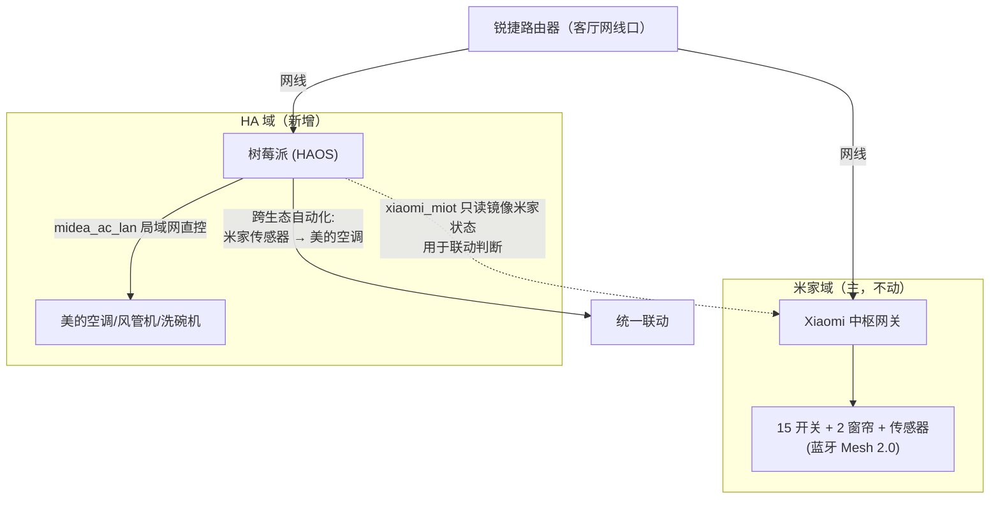
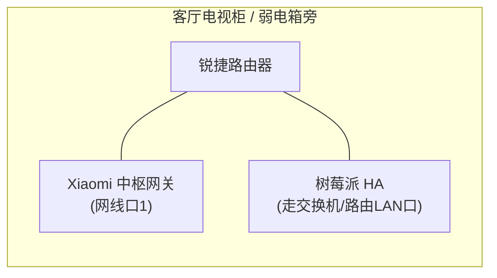
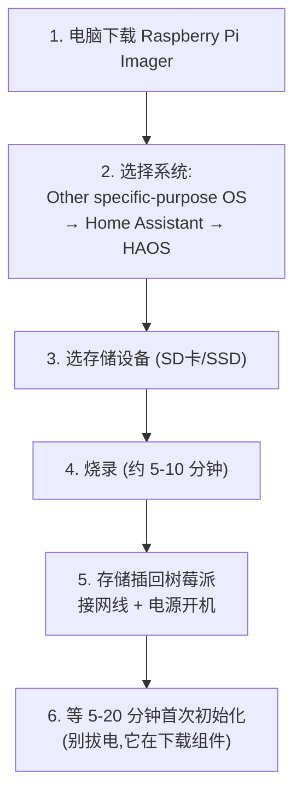
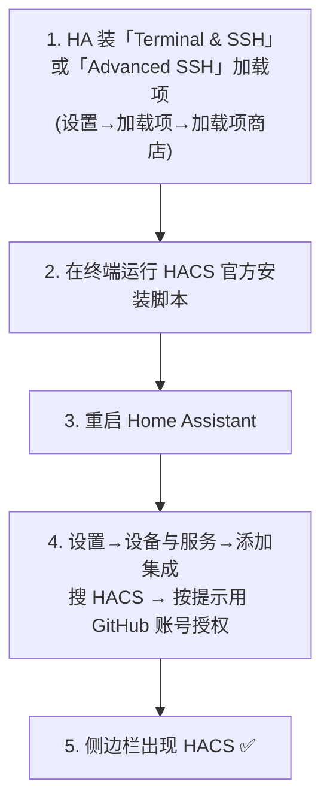
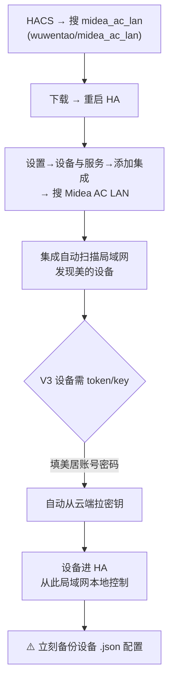
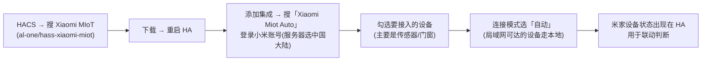
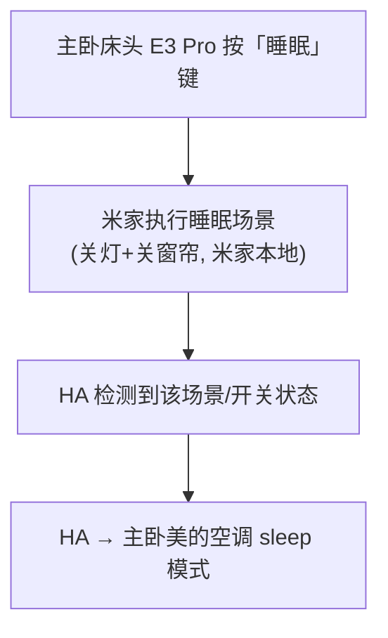
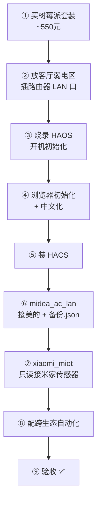

# 11 - Home Assistant 落地全流程（针对你家户型）

::: tip 读这篇前
先看 [10-Home Assistant 入门](./10-home-assistant.md) 搞懂 HA 是什么。这篇是**动手落地**：买什么、放哪、怎么装、怎么接美的、怎么联动、怎么验收，全部针对你家户型给出具体方案。
:::

## 本方案的定位（先说清楚边界）

::: warning 米家为主，HA 只做两件事
1. **接入美的设备**（空调/风管机/洗碗机）—— 米家接不了的，交给 HA
2. **跨生态联动** —— 米家传感器触发美的空调，这是米家做不到的

**不动的部分**：灯光、窗帘、开关、场景**继续在米家里玩**，物理按键照常按，老人小孩完全无感。HA 只是多了个「总指挥」，不是推翻重来。
:::

---

## 一、买什么（硬件清单）

::: info 树莓派方案，一次到位约 ¥550
| # | 物品 | 推荐型号 | 参考价 | 说明 |
|---|------|---------|--------|------|
| 1 | 主板 | 树莓派 4B（4GB）或 5（4GB） | ¥380-450 | 4GB 足够跑 HA + 接美的；5 更快但非必需 |
| 2 | 存储 | 官方/三星 32GB microSD 或 USB SSD | ¥40-120 | **强烈建议 SSD**：SD 卡易损耗，HA 频繁写日志 |
| 3 | 电源 | 官方原装电源 | ¥40 | 树莓派对供电敏感，别用杂牌 |
| 4 | 外壳 | 带散热风扇外壳 | ¥30-50 | 长期运行需散热 |
| 5 | 网线 | 一根短网线 | ¥10 | **必须有线连路由器**，不走 Wi-Fi |
:::

::: tip 为什么选树莓派、为什么有线
- **树莓派**：装 HAOS 最省心、社区教程最多、功耗低（24 小时常开也才几瓦）、适合家庭全屋这种轻量场景。
- **必须有线**：HA 要和路由器、中枢网关、美的设备稳定通信，有线最稳。你家客厅网线口正好够用。
- **建议 SSD 不用 SD 卡**：HA 日志写入频繁，SD 卡一两年就可能损耗坏，SSD 寿命长得多。
:::

---

## 二、放哪（针对你家户型）

你家网线口只有**客厅（电视旁）+ 书房/卧室B** 两个。中枢网关已经占了客厅网线口。树莓派的最佳位置：

::: info 客厅网线口只有一个怎么办？
路由器一般有多个 LAN 口，树莓派直接插路由器的空闲 LAN 口即可，**不需要额外网线口**。如果路由器 LAN 口不够，加一个 ¥30 的小交换机。

- 树莓派和中枢网关都放客厅弱电区/电视柜
- 树莓派功耗低、无噪音（选无风扇或低速风扇外壳），藏电视柜里即可
- **不要放卧室/书房**：HA 要离路由器近、和美的设备同一局域网，客厅最合适
:::

::: warning 和中枢网关的关系
树莓派**不替代**中枢网关。中枢网关继续做蓝牙 Mesh 大脑管米家设备；树莓派只管美的设备 + 跨生态联动。两者各跑各的，都插在路由器上，通过局域网协作。
:::

---

## 三、装系统（烧录 HAOS）

HAOS = Home Assistant Operating System，是官方专为树莓派做的系统，开箱即用。

::: details 详细步骤
1. **电脑装 Raspberry Pi Imager**（官方烧录工具，[raspberrypi.com/software](https://www.raspberrypi.com/software/)）
2. 打开 Imager → 选设备型号（树莓派 4 或 5）→ 选操作系统：`Other specific-purpose OS` → `Home assistants and home automation` → `Home Assistant` → 选 HAOS 版本
3. 选你的 SD 卡 / SSD → 点烧录 → 等完成
4. 存储插回树莓派，**插网线连路由器**，接电源开机
5. 首次开机会自动下载安装组件，**耐心等 5-20 分钟**，期间别拔电
:::

---

## 四、初始化 + 中文化

::: tip 打不开 homeassistant.local:8123？
- 换用树莓派的 IP 地址访问，如 `http://192.168.1.50:8123`
- IP 在路由器后台的「设备列表」里找（找名字含 homeassistant 的）
- 确认电脑/手机和树莓派在**同一个局域网**（同一个路由器下）
:::

---

## 五、装 HACS（第三方集成商店）

接美的、接米家都靠 HACS 里的第三方集成。HAOS 默认不带 HACS，需要装一次。

::: tip 装 HACS 的关键点
- HACS 安装需要能访问 GitHub，国内网络可能需要给 HA 配代理（设置→系统→网络，或在路由器层面解决）
- 装好后，HACS 就是你的「第三方集成应用市场」，`midea_ac_lan` 和 `xiaomi_miot` 都从这里装
- 详细脚本以 [HACS 官网](https://hacs.xyz/) 最新文档为准（命令会变）
:::

---

## 六、接美的设备（midea_ac_lan）

你的空调/风管机**已经联网到美居 App**，这是接入前提，已满足 ✅。

| 设备 | 协议 | 支持度 | 备注 |
|------|------|--------|------|
| 美的空调 | `0xAC` | ✅ 完美 | 温度/模式/风速/sleep/eco 全可控 |
| 美的风管机 | `0xAC` | ✅ | 同空调协议 |
| 美的洗碗机 | `0xE1`/`0x34` | ⚠️ 查型号 | 先看仓库 `doc/E1.md` |

::: danger 2026 必读：装好立刻备份
美的正逐步关闭旧 Token API，以后可能无法新增设备。**现在趁能用赶紧接入，并把每台设备的 `.json` 配置备份到树莓派之外**（U盘/电脑/NAS）。详见 [09-美的美居接入米家](./09-midea-to-mijia.md) 第四节。
:::

> 完整接入细节、三条路线对比、红外保底方案 → [09-美的美居接入米家](./09-midea-to-mijia.md)

---

## 七、把米家状态镜像进 HA（xiaomi_miot，只读用）

按本方案定位，米家设备**主控仍在米家**。但 HA 要做「米家传感器 → 美的空调」的联动，就需要在 HA 里**能读到米家设备的状态**。用 `xiaomi_miot` 集成实现。

::: tip 只接需要的，别全搬
- **只接联动会用到的米家设备**：人体传感器、门窗传感器、温湿度传感器
- 灯光/开关/窗帘**不必接进来**（它们继续在米家控，HA 不需要管）
- 连接模式选 **「自动」**：支持 miot-spec 的设备会自动走局域网本地连接（v0.4.4+），契合你「本地优先」原则；少数 BLE/ZigBee 设备走云端
- 注意：本地模式要求 HA 和设备在**同一子网/VLAN**，否则设备不响应
:::

---

## 八、跨生态联动实例（针对你家户型）

这是上 HA 的**核心价值**。在 HA 的「设置→自动化」里配置：

| 联动 | 触发（米家设备） | 动作（美的设备） | 户型场景 |
|------|----------------|----------------|---------|
| 回家开空调 | 入户门门窗传感器「开门」 | 客厅空调制冷 26℃ | 进门即凉 |
| 离家关空调 | 米家「离家模式」 | 关全部空调+风管机 | 出门不浪费 |
| 温度联动风管机 | 客厅温湿度 > 28℃ | 风管机自动制冷 | 客厅 21㎡ 大空间 |
| 睡眠降噪 | 主卧床头开关「睡眠」键 | 主卧空调 sleep 模式 | 主卧 17.7㎡ |
| 洗碗完成提醒 | 美的洗碗机「完成」 | 小爱播报/客厅灯闪 | 厨房 6.1㎡ |

::: info 为什么联动要放 HA 里而不是米家
米家里只有米家设备、美居里只有美的设备。**只有 HA 同时握着两边**，才能「米家触发 → 美的执行」。这正是上 HA 的唯一理由。
:::

---

## 九、落地全流程总览

---

## 十、验收 Checklist

**硬件**
- [ ] 树莓派有线连路由器，能稳定开机
- [ ] 用 SSD/优质 SD 卡，已规划好备份

**HA 基础**
- [ ] `homeassistant.local:8123` 能打开
- [ ] 管理员账号建好，已中文化
- [ ] HACS 安装成功，侧边栏可见

**美的接入**
- [ ] 空调出现在 HA，能开关/调温
- [ ] 风管机出现在 HA，能控制
- [ ] 洗碗机已确认型号支持情况
- [ ] **每台美的设备的 `.json` 已备份到树莓派之外**

**米家镜像**
- [ ] 联动要用的米家传感器状态能在 HA 里看到
- [ ] 灯光/开关**未**多余接入（保持米家主控）

**跨生态联动**
- [ ] 开门 → 空调启动（实测）
- [ ] 离家 → 空调全关（实测）
- [ ] 温度超阈值 → 风管机制冷（实测或模拟）

**稳定性**
- [ ] 关掉外网（拔光猫）测试：米家灯光物理按键正常、HA 本地控制美的正常
- [ ] 树莓派断电重启后，HA 自动恢复运行

::: tip 一句话总结落地路径
**买树莓派 → 放客厅插路由器 → 烧 HAOS → 装 HACS → midea_ac_lan 接美的（备份 json）→ xiaomi_miot 只读接米家传感器 → 配跨生态自动化。** 全程米家不动，HA 只做美的接入和跨品牌联动。
:::

## 参考来源

- [Home Assistant 官方安装文档](https://www.home-assistant.io/installation/raspberrypi)
- [HACS 官网](https://hacs.xyz/)
- [wuwentao/midea_ac_lan](https://github.com/wuwentao/midea_ac_lan)
- [al-one/hass-xiaomi-miot（Xiaomi MIoT 集成）](https://github.com/al-one/hass-xiaomi-miot)
